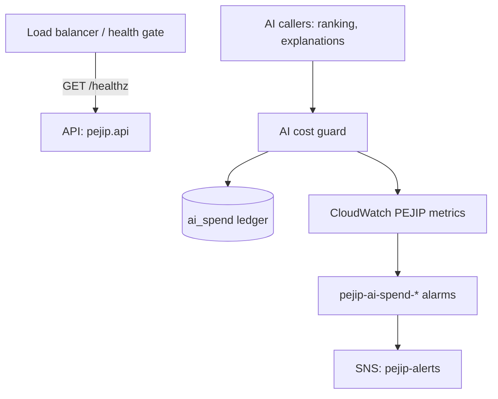

# Components

_Status: first component landed. Add a section per component as it is introduced._

For each component, record:

- **Responsibility:** what it owns, in one or two sentences.
- **Interfaces:** the APIs, events or files it exposes and consumes.
- **Data:** the data it stores or reads.
- **Design doc:** link to its doc in [docs/design/](../design/).

## API (`pejip.api`)

- **Responsibility:** the HTTP surface of PEJIP. Today it serves only the health
  endpoint; feature endpoints are added here.
- **Interfaces:** `GET /healthz`; the OpenAPI document at `/openapi.json`. Run with
  `python -m pejip.api` (`PEJIP_HOST`, `PEJIP_PORT`).
- **Data:** none.
- **Design doc:** [0001: CI pipeline and health endpoint](../design/0001-ci-pipeline.md).

## AI cost guard

- **Responsibility:** enforces the $100 monthly Claude API cap before each call and
  records what each call cost (policy section 13).
- **Interfaces:** `pejip.cost.CostGuard.reserve(...)` returning a reservation that is
  settled with the API response's `usage`; raises `BudgetExceededError` at the cap.
  Publishes `PEJIP/AISpendMonthToDateUSD` and `PEJIP/AICallCostUSD` to CloudWatch.
- **Data:** the `ai_spend` SQLite table (feature, model, tokens, cost; no personal
  data) and the price table `src/pejip/cost/pricing.json`.
- **Design doc:** [0002: AI cost guard](../design/0002-ai-cost-guard.md).

## Golden evaluation harness (`src/pejip/evaluation`)

- **Responsibility:** scores any ranking implementation against the labelled golden
  set and fails CI when a metric drops below the committed baseline.
- **Interfaces:** consumes a scorer callable (`EvalInput` in, `Prediction` out);
  exposes `python -m pejip.evaluation validate | run | ratchet`.
- **Data:** reads `eval/golden/` (synthetic cases and profile) and
  `eval/baseline.json`; writes an optional JSON report.
- **Design doc:** [0003: Golden evaluation set](../design/0003-golden-evaluation-set.md).

## Data retention (`pejip.retention`)

- **Responsibility:** defines the 90-day retention window for personal data, job
  postings and rankings (policy section 10) and deletes expired files.
- **Interfaces:** `cutoff(now, days=90)` (rejects windows longer than 90 days) and
  `purge_files(directory, now, days=90)`; every store purges rows older than
  `cutoff`.
- **Data:** none of its own; deletes expired digest and export files.
- **Design doc:** [0004: Data retention](../design/0004-data-retention.md).

## Claude credentials (`pejip.claude_auth`)

- **Responsibility:** gives every Claude caller short-lived credentials through
  Workload Identity Federation, so no Claude API key exists in CI or AWS
  ([ADR-0004](../adr/0004-keyless-claude-access.md)).
- **Interfaces:** `federation_credentials(env, sts=...)` returns the arguments for
  the SDK's `WorkloadIdentityCredentials` (or `None` on a developer machine); reads
  `PEJIP_CLAUDE_IDENTITY` and the `ANTHROPIC_*` federation IDs; raises
  `ClaudeAuthError` on misconfiguration or a leftover API key. Consumes the GitHub
  Actions OIDC endpoint or AWS STS `GetWebIdentityToken`.
- **Data:** none stored; tokens live in memory only.
- **Design doc:** [0007: Keyless Claude access](../design/0007-claude-identity-federation.md).
