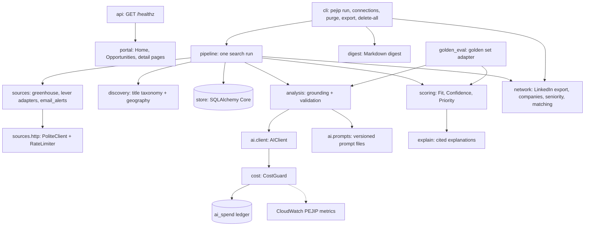

# Components

The Phase 1 thin slice is one Python package, `pejip` (`src/pejip/`), run as a
batch CLI ([ADR-0003](../adr/0003-python-cli-first-slice.md)). Feature detail is in
[design doc 0008](../design/0008-find-thin-slice.md).

## cli

- **Responsibility:** command line entry point; wires configuration, profile,
  store, HTTP and AI clients together.
- **Interfaces:** `pejip run | connections <file> | purge | export <file> |
  delete-all --yes`; environment variables `PEJIP_CONFIG`, `PEJIP_PROFILE`,
  `PEJIP_DATABASE_URL`, `PEJIP_OUTPUT_DIR`, `PEJIP_AI_LEDGER` (the cost guard's
  SQLite file), `PEJIP_CONNECTIONS` and `PEJIP_NETWORK_DECISIONS` (the LinkedIn
  export and the candidate's network decisions), and Claude
  credentials through `pejip.claude_auth` (`ANTHROPIC_API_KEY` locally).
- **Data:** writes `digest-*.md` to the output directory.

## pipeline

- **Responsibility:** one search run: purge expired data, fetch every source,
  filter, upsert, analyse new or changed roles, score, explain and assemble the
  digest. Isolates source and analysis failures.
- **Interfaces:** `Pipeline.run() -> Digest`.
- **Data:** reads and writes all store tables.

## sources and sources.http

- **Responsibility:** adapters turn Greenhouse and Lever board payloads into
  `Posting` records. `PoliteClient` is the only HTTP path: per-host rate limit,
  `robots.txt`, user agent, backoff on 429 and 5xx. `email_alerts` reads job-alert
  emails from PEJIP's own S3 inbox (boto3, task role credentials) and turns each
  link to a configured careers page into a `Posting`; it fetches no web page
  ([design 0010](../design/0010-job-alert-inbox.md)).
- **Interfaces:** `fetch_greenhouse(client, source)`, `fetch_lever(client, source)`,
  `S3Inbox(client, bucket)` with `message_keys`, `read` and `delete`, and
  `parse_alert(raw, companies) -> AlertMessage`.
- **Data:** none stored; allowed sources are listed in [docs/sources.md](../sources.md).

## network

- **Responsibility:** connection matching
  ([design 0014](../design/0014-connection-matching.md)): parse a LinkedIn
  Connections export, resolve employer names to tracked companies without
  guessing, read a seniority level from a title, and find matured connections
  for a role. Unclear titles and ambiguous employers wait for the candidate.
- **Interfaces:** `linkedin.parse_export`, `linkedin.compare_imports`,
  `companies.CompanyDirectory`, `seniority.title_level`,
  `matching.NetworkIndex.signal -> NetworkSignal`, `loader.load_index`.
- **Data:** imports are not stored yet; reads the export and decisions files named in the
  environment. The "Who you know" lines are saved inside each recommendation.

## discovery

- **Responsibility:** deterministic pre-filter by title taxonomy (with VP / Sr.
  normalization) and geography scopes, before any AI spend.
- **Interfaces:** `is_candidate`, `classify_location`, `normalize_title`.

## ai.client and ai.prompts

- **Responsibility:** the single AI client. Reserves each call's worst-case cost
  with the AI cost guard (which refuses it at the cap), settles the actual usage,
  requests schema-constrained JSON, retries malformed output once and raises
  `AIError` otherwise. Prompts are versioned files loaded by id.
- **Interfaces:** `AIClient(config, guard).structured(feature, prompt, content, schema,
  schema_version)`.
- **Data:** none of its own; spend goes to the cost guard's `ai_spend` ledger.

## analysis

- **Responsibility:** runs JOB_ANALYSIS and EVIDENCE_MATCHING, then grounds the
  output: requirement quotes must be in the posting, evidence ids must exist in the
  profile, unsupported matches become UNKNOWN.
- **Interfaces:** `analyze_job(...) -> AnalysisOutcome`.
- **Data:** `analyses` table (via pipeline).

## scoring and explain

- **Responsibility:** deterministic Fit, Confidence, Priority and reason codes;
  explanations with citations that must resolve to stored data.
- **Interfaces:** `score_job(...) -> Recommendation`, `build_explanation`,
  `verify_citations`.
- **Data:** `recommendations` table (via pipeline). Weights and thresholds come from
  `config/search.yaml`.

## store

- **Responsibility:** persistence, 90-day retention, export and deletion.
- **Interfaces:** `Store(database_url)`.
- **Data:** `jobs`, `analyses`, `recommendations`, `runs`.

## logs

- **Responsibility:** JSON log lines with the run id; redacts personal fields and
  scrubs e-mail addresses and phone numbers.

## golden_eval

- **Responsibility:** the scorer the golden evaluation harness runs: maps a golden
  case and the synthetic profile onto this pipeline, scores it with `score_job`
  and `build_explanation`, and translates reason codes into the set's vocabulary.
- **Interfaces:** `replay_scorer` (from `eval/recordings/<case>.json`) and
  `live_scorer` (calls the model; `PEJIP_EVAL_RECORD_DIR` saves its output), used as
  `python -m pejip.evaluation run --scorer pejip.golden_eval:<scorer>`.

## API (`pejip.api`)

- **Responsibility:** the HTTP surface of PEJIP: the health endpoint and the web
  portal's pages.
- **Interfaces:** `GET /healthz`; the portal pages `GET /`, `/opportunities`,
  `/opportunities/{id}` and `/portal.css`; the OpenAPI document at `/openapi.json`. Run with
  `python -m pejip.api` (`PEJIP_HOST`, `PEJIP_PORT`). Every route except
  `/healthz` requires Babu's Google sign-in: `pejip.auth` checks the ALB's signed
  `x-amzn-oidc-data` token against `PEJIP_AUTH_ALLOWED_EMAIL` and
  `PEJIP_AUTH_ALB_ARN` ([0009: Google sign-in](../design/0009-google-sign-in.md)).
- **Data:** none.
- **Deployment:** the image's default command; runs as ECS service `pejip-prod`
  behind `pejip-alb` ([0005: App hosting and deploy](../design/0005-app-hosting-and-deploy.md)).
- **Design doc:** [0001: CI pipeline and health endpoint](../design/0001-ci-pipeline.md).

## Portal (`pejip.portal`)

- **Responsibility:** server-rendered Home, Opportunities and Opportunity detail
  pages built from the portal mocks; ranking, saved views, filters and Pacific time
  display.
- **Interfaces:** `portal.router(data, clock)` mounted by `create_app`; reads a
  `PortalData` (`is_sample`, `latest_run()`, `opportunities()`). Pages get their own
  content security policy (`PAGE_CSP`), with no script.
- **Data:** none stored. `SampleData` (synthetic) until a store-backed reader lands.
- **Design doc:** [0013: Web portal](../design/0013-web-portal.md).

## AI cost guard

- **Responsibility:** enforces the $100 monthly Claude API cap before each call and
  records what each call cost (policy section 13).
- **Interfaces:** `pejip.cost.CostGuard.reserve(...)` returning a reservation that is
  settled with the API response's `usage`; raises `BudgetExceededError` at the cap.
  Publishes `PEJIP/AISpendMonthToDateUSD` and `PEJIP/AICallCostUSD` to CloudWatch.
- **Data:** the `ai_spend` SQLite table (feature, model, tokens, cost; no personal
  data) and the price table `src/pejip/cost/pricing.json`.
- **Design doc:** [0002: AI cost guard](../design/0002-ai-cost-guard.md).

## Golden evaluation harness (`src/pejip/evaluation`)

- **Responsibility:** scores any ranking implementation against the labelled golden
  set and fails CI when a metric drops below the committed baseline.
- **Interfaces:** consumes a scorer callable (`EvalInput` in, `Prediction` out);
  exposes `python -m pejip.evaluation validate | run | ratchet`.
- **Data:** reads `eval/golden/` (synthetic cases and profile) and
  `eval/baseline.json`; writes an optional JSON report.
- **Design doc:** [0003: Golden evaluation set](../design/0003-golden-evaluation-set.md).

## Data retention (`pejip.retention`)

- **Responsibility:** defines the 90-day retention window for personal data, job
  postings and rankings (policy section 10) and deletes expired files.
- **Interfaces:** `cutoff(now, days=90)` (rejects windows longer than 90 days) and
  `purge_files(directory, now, days=90)`; every store purges rows older than
  `cutoff`.
- **Data:** none of its own; deletes expired digest and export files.
- **Design doc:** [0004: Data retention](../design/0004-data-retention.md).

## Claude credentials (`pejip.claude_auth`)

- **Responsibility:** gives every Claude caller short-lived credentials through
  Workload Identity Federation, so no Claude API key exists in CI or AWS
  ([ADR-0004](../adr/0004-keyless-claude-access.md)).
- **Interfaces:** `federation_credentials(env, sts=...)` returns the arguments for
  the SDK's `WorkloadIdentityCredentials` (or `None` on a developer machine); reads
  `PEJIP_CLAUDE_IDENTITY` and the `ANTHROPIC_*` federation IDs; raises
  `ClaudeAuthError` on misconfiguration or a leftover API key. Consumes the GitHub
  Actions OIDC endpoint or AWS STS `GetWebIdentityToken`.
- **Data:** none stored; tokens live in memory only.
- **Design doc:** [0007: Keyless Claude access](../design/0007-claude-identity-federation.md).
