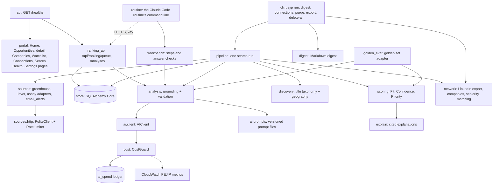

# Components

The Phase 1 thin slice is one Python package, `pejip` (`src/pejip/`), run as a
batch CLI ([ADR-0003](../adr/0003-python-cli-first-slice.md)). Feature detail is in
[design doc 0008](../design/0008-find-thin-slice.md).

## cli

- **Responsibility:** command line entry point; wires configuration, profile,
  store, HTTP and AI clients together.
- **Interfaces:** `pejip run | digest | connections <file> | purge | export <file> [--account <id>] |
  delete-all --yes [--account <id>]`; environment variables `PEJIP_CONFIG`, `PEJIP_PROFILE`,
  `PEJIP_DATABASE_URL`, `PEJIP_OUTPUT_DIR`, `PEJIP_AI_LEDGER` (the cost guard's
  SQLite file), `PEJIP_INBOX_BUCKET`, `PEJIP_PROFILE_PARAMETER` (profile from SSM
  instead of a file), `PEJIP_DIGEST_TOPICS` (each account's digest topic; `PEJIP_DIGEST_TOPIC_ARN`
  still works for Babu alone), `PEJIP_ACCOUNTS` (the accounts the scheduled
  commands loop over),
  `PEJIP_AI_ENABLED`, `PEJIP_RANKER` (`routine`: `run` makes no Claude calls and
  sends nothing, and `digest` emails the latest run ranked by the routine's stored
  analyses), `PEJIP_CONNECTIONS` and `PEJIP_NETWORK_DECISIONS` (the LinkedIn
  export and the candidate's network decisions), `PEJIP_NETWORK_BUCKET` (where
  they are uploaded on AWS), `PEJIP_COMPANIES` and `PEJIP_COMPANIES_PARAMETER`
  (Babu's private company list, from a file or SSM; ADR-0009), and Claude
  credentials through `pejip.claude_auth` (`ANTHROPIC_API_KEY` locally).
- **Data:** writes `digest-*.md` to the output directory and, when a topic is set,
  emails it through `pejip.delivery`.

## ranking_api

- **Responsibility:** the ranking routine's two endpoints
  ([design 0015](../design/0015-ranking-routine.md)): serve the latest run's roles
  that need analysis with the profile's matching fields, and validate, ground and
  store the routine's answers. They skip Google sign-in and check a bearer key
  against each account's SHA-256 in SSM; the matching key picks the account whose
  roles and profile the request sees ([design 0016](../design/0016-accounts.md)).
- **Interfaces:** `GET /api/ranking/queue`, `POST /api/ranking/analyses`;
  `PEJIP_RANKING_KEY_PARAMETER` (or `PEJIP_RANKING_KEY_SHA256` in tests and DAST).
- **Data:** reads jobs and runs, writes `analyses` rows with provenance
  `ranker: routine`.

## routine and workbench

- **Responsibility:** the command line the Claude Code routine runs
  (`python -m pejip.routine`): fetch the queue, lay out one folder per role, name
  each next step with the API path's prompt, input and schema, check each answer
  the way the API path does, and submit; also runs the golden set the same way.
- **Interfaces:** `fetch | next | skip | submit | eval-prepare | eval-record`;
  `PEJIP_RANKING_URL`, `PEJIP_RANKING_KEY`.
- **Data:** scratch files in the routine's work folder only; nothing committed.

## delivery

- **Responsibility:** emails the digest through the `pejip-digest` SNS topic,
  cutting it to fit SNS's message limit.
- **Interfaces:** `send_digest(client, topic_arn, digest, text, kept_at)`.
- **Data:** none stored.

## pipeline

- **Responsibility:** one search run: purge expired data, fetch every source,
  filter, upsert, analyse new or changed roles, score, explain and assemble the
  digest. Isolates source and analysis failures. Without a profile or Claude it
  still stores roles and lists them unranked with the reason.
- **Interfaces:** `Pipeline.run() -> Digest`.
- **Data:** reads and writes all store tables.

## sources and sources.http

- **Responsibility:** adapters turn Greenhouse, Lever and Ashby board payloads into
  `Posting` records. `PoliteClient` is the only HTTP path: per-host rate limit,
  `robots.txt`, user agent, backoff on 429 and 5xx. `email_alerts` reads job-alert
  emails from PEJIP's own S3 inbox (boto3, task role credentials) and turns each
  link to a configured careers page into a `Posting`; it fetches no web page
  ([design 0010](../design/0010-job-alert-inbox.md)).
- **Interfaces:** `fetch_greenhouse(client, source)`, `fetch_lever(client, source)`,
  `fetch_ashby(client, source)`,
  `S3Inbox(client, bucket)` with `message_keys`, `read` and `delete`, and
  `parse_alert(raw, companies) -> AlertMessage`.
- **Data:** none stored; allowed sources are listed in [docs/sources.md](../sources.md).

## network

- **Responsibility:** connection matching
  ([design 0014](../design/0014-connection-matching.md)): parse a LinkedIn
  Connections export, resolve employer names to tracked companies without
  guessing, read a seniority level from a title, and find matured connections
  for a role. Unclear titles and ambiguous employers wait for the candidate.
- **Interfaces:** `linkedin.parse_export`, `linkedin.compare_imports`,
  `companies.CompanyDirectory`, `seniority.title_level`,
  `matching.NetworkIndex.signal -> NetworkSignal`, `loader.load_index`,
  `loader.load_index_s3`.
- **Data:** imports are not stored yet; reads the export and decisions files named in the
  environment. The "Who you know" lines are saved inside each recommendation.

## discovery

- **Responsibility:** deterministic pre-filter by title taxonomy (with VP / Sr.
  normalization) and geography scopes, before any AI spend.
- **Interfaces:** `is_candidate`, `classify_location`, `normalize_title`.

## ai.client and ai.prompts

- **Responsibility:** the single AI client. Reserves each call's worst-case cost
  with the AI cost guard (which refuses it at the cap), settles the actual usage,
  requests schema-constrained JSON, retries malformed output once and raises
  `AIError` otherwise. Prompts are versioned files loaded by id.
- **Interfaces:** `AIClient(config, guard).structured(feature, prompt, content, schema,
  schema_version)`.
- **Data:** none of its own; spend goes to the cost guard's `ai_spend` ledger.

## analysis

- **Responsibility:** runs JOB_ANALYSIS and EVIDENCE_MATCHING, then grounds the
  output: requirement quotes must be in the posting, evidence ids must exist in the
  profile, unsupported matches become UNKNOWN.
- **Interfaces:** `analyze_job(...) -> AnalysisOutcome`.
- **Data:** `analyses` table (via pipeline).

## scoring and explain

- **Responsibility:** deterministic Fit, Confidence, Priority and reason codes;
  explanations with citations that must resolve to stored data.
- **Interfaces:** `score_job(...) -> Recommendation`, `build_explanation`,
  `verify_citations`.
- **Data:** `recommendations` table (via pipeline). Weights and thresholds come from
  `config/search.yaml`.

## store

- **Responsibility:** persistence, 90-day retention, export and deletion.
- **Interfaces:** `Store(database_url)`.
- **Data:** `jobs`, `analyses`, `recommendations`, `runs`.

## logs

- **Responsibility:** JSON log lines with the run id; redacts personal fields and
  scrubs e-mail addresses and phone numbers.
- **Monitoring:** CloudWatch log metric filters count `run_finished` (by status),
  `source_failed` and ERROR lines into the `PEJIP` namespace for the search, source
  and error alarms and the `pejip` dashboard
  ([design 0011](../design/0011-monitoring.md)). `pejip run` logs `run_crashed` at
  ERROR when it raises.

## golden_eval

- **Responsibility:** the scorer the golden evaluation harness runs: maps a golden
  case and the synthetic profile onto this pipeline, scores it with `score_job`
  and `build_explanation`, and translates reason codes into the set's vocabulary.
- **Interfaces:** `replay_scorer` (from `eval/recordings/<case>.json`) and
  `live_scorer` (calls the model; `PEJIP_EVAL_RECORD_DIR` saves its output), used as
  `python -m pejip.evaluation run --scorer pejip.golden_eval:<scorer>`.

## API (`pejip.api`)

- **Responsibility:** the HTTP surface of PEJIP: the health endpoint and the web
  portal's pages.
- **Interfaces:** `GET /healthz`; the portal pages `GET /`, `/opportunities`,
  `/opportunities/{id}` (and `POST /opportunities/{id}/decision`), `/companies`, `/watchlist`, `/connections`, `/search-health`, `/settings` and `/portal.css`; `POST /signout` (and `GET`, for the return from an expired session) and `GET /signed-out`; the OpenAPI document at `/openapi.json`. Settings
  shows the search setup with Babu's private companies (ADR-0009). Run with
  `python -m pejip.api` (`PEJIP_HOST`, `PEJIP_PORT`). Every route except
  `/healthz`, `/signed-out` and `/portal.css` (and the ranking routes, below) requires Google sign-in: `pejip.auth` checks the ALB's signed
  `x-amzn-oidc-data` token against `PEJIP_AUTH_ALB_ARN`, maps the email to an
  account in `PEJIP_AUTH_ACCOUNTS` and puts it on `request.state.account`
  ([0009: Google sign-in](../design/0009-google-sign-in.md),
  [0016: Separate, private accounts](../design/0016-accounts.md)).
- **Data:** none.
- **Deployment:** the image's default command; runs as ECS service `pejip-prod`
  behind `pejip-alb` ([0005: App hosting and deploy](../design/0005-app-hosting-and-deploy.md)).
- **Design doc:** [0001: CI pipeline and health endpoint](../design/0001-ci-pipeline.md).

## Portal (`pejip.portal`)

- **Responsibility:** server-rendered Home, Opportunities, Opportunity detail,
  Companies, Watchlist, Connections, Search Health and Settings pages built from the portal mocks; ranking, saved views, filters and Pacific time
  display.
- **Interfaces:** `portal.router(data, clock, config, config_for, data_for)` mounted by `create_app`, which passes each account's data and the
  search configuration from `PEJIP_CONFIG` for Settings; reads a
  `PortalData` (`is_sample`, `latest_run()`, `recent_runs()`, `opportunities()`, `companies()`, `network()`), and records
  decisions through `Decisions.decide()` when the source supports it. Pages get their own
  content security policy (`PAGE_CSP`), with no script.
- **Data:** writes only the `decisions` table. `StoreData` reads each signed-in account's database (jobs seen in the last week, latest
  recommendations and explanations, recent runs, decisions); `SampleData` (synthetic) only when no database is configured.
- **Design doc:** [0013: Web portal](../design/0013-web-portal.md).

## AI cost guard

- **Responsibility:** enforces the $100 monthly Claude API cap before each call and
  records what each call cost (policy section 13).
- **Interfaces:** `pejip.cost.CostGuard.reserve(...)` returning a reservation that is
  settled with the API response's `usage`; raises `BudgetExceededError` at the cap.
  Publishes `PEJIP/AISpendMonthToDateUSD` and `PEJIP/AICallCostUSD` to CloudWatch.
- **Data:** the `ai_spend` SQLite table (feature, model, tokens, cost; no personal
  data) and the price table `src/pejip/cost/pricing.json`.
- **Design doc:** [0002: AI cost guard](../design/0002-ai-cost-guard.md).

## Golden evaluation harness (`src/pejip/evaluation`)

- **Responsibility:** scores any ranking implementation against the labelled golden
  set and fails CI when a metric drops below the committed baseline.
- **Interfaces:** consumes a scorer callable (`EvalInput` in, `Prediction` out);
  exposes `python -m pejip.evaluation validate | run | ratchet`.
- **Data:** reads `eval/golden/` (synthetic cases and profile) and
  `eval/baseline.json`; writes an optional JSON report.
- **Design doc:** [0003: Golden evaluation set](../design/0003-golden-evaluation-set.md).

## Data retention (`pejip.retention`)

- **Responsibility:** defines the 90-day retention window for personal data, job
  postings and rankings (policy section 10) and deletes expired files.
- **Interfaces:** `cutoff(now, days=90)` (rejects windows longer than 90 days) and
  `purge_files(directory, now, days=90)`; every store purges rows older than
  `cutoff`.
- **Data:** none of its own; deletes expired digest and export files.
- **Design doc:** [0004: Data retention](../design/0004-data-retention.md).

## Claude credentials (`pejip.claude_auth`)

- **Responsibility:** gives every Claude caller short-lived credentials through
  Workload Identity Federation, so no Claude API key exists in CI or AWS
  ([ADR-0004](../adr/0004-keyless-claude-access.md)).
- **Interfaces:** `federation_credentials(env, sts=...)` returns the arguments for
  the SDK's `WorkloadIdentityCredentials` (or `None` on a developer machine); reads
  `PEJIP_CLAUDE_IDENTITY` and the `ANTHROPIC_*` federation IDs; raises
  `ClaudeAuthError` on misconfiguration or a leftover API key. Consumes the GitHub
  Actions OIDC endpoint or AWS STS `GetWebIdentityToken`.
- **Data:** none stored; tokens live in memory only.
- **Design doc:** [0007: Keyless Claude access](../design/0007-claude-identity-federation.md).
