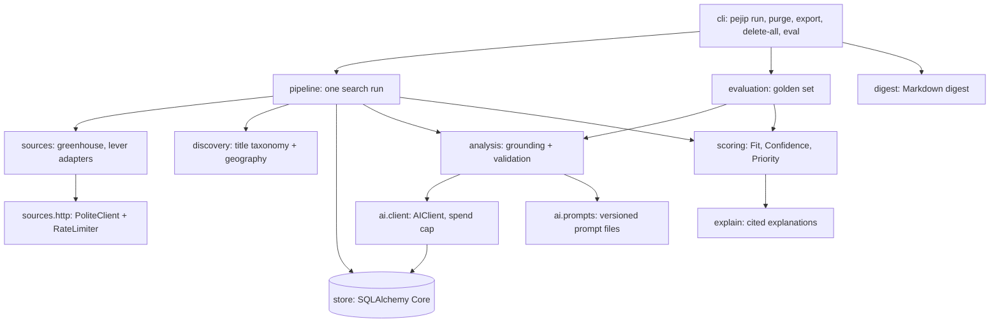

# Components

The Phase 1 thin slice is one Python package, `pejip` (`src/pejip/`), run as a
batch CLI ([ADR-0002](../adr/0002-python-cli-first-slice.md)). Feature detail is in
[design doc 0001](../design/0001-find-thin-slice.md).

## cli

- **Responsibility:** command line entry point; wires configuration, profile,
  store, HTTP and AI clients together.
- **Interfaces:** `pejip run | purge | export <file> | delete-all --yes | eval [--live]`;
  environment variables `PEJIP_CONFIG`, `PEJIP_PROFILE`, `PEJIP_DATABASE_URL`,
  `PEJIP_OUTPUT_DIR`, `ANTHROPIC_API_KEY`.
- **Data:** writes `digest-*.md` to the output directory.

## pipeline

- **Responsibility:** one search run: purge expired data, fetch every source,
  filter, upsert, analyse new or changed roles, score, explain and assemble the
  digest. Isolates source and analysis failures.
- **Interfaces:** `Pipeline.run() -> Digest`.
- **Data:** reads and writes all store tables.

## sources and sources.http

- **Responsibility:** adapters turn Greenhouse and Lever board payloads into
  `Posting` records. `PoliteClient` is the only HTTP path: per-host rate limit,
  `robots.txt`, user agent, backoff on 429 and 5xx.
- **Interfaces:** `fetch_greenhouse(client, source)`, `fetch_lever(client, source)`.
- **Data:** none stored; allowed sources are listed in [docs/sources.md](../sources.md).

## discovery

- **Responsibility:** deterministic pre-filter by title taxonomy (with VP / Sr.
  normalization) and geography scopes, before any AI spend.
- **Interfaces:** `is_candidate`, `classify_location`, `normalize_title`.

## ai.client and ai.prompts

- **Responsibility:** the single AI client. Checks the monthly cap before each
  call, records spend per feature and model, logs threshold alerts, requests
  schema-constrained JSON, retries malformed output once and raises `AIError`
  otherwise. Prompts are versioned files loaded by id.
- **Interfaces:** `AIClient.structured(feature, prompt, content, schema, schema_version)`.
- **Data:** `ai_usage` table.

## analysis

- **Responsibility:** runs JOB_ANALYSIS and EVIDENCE_MATCHING, then grounds the
  output: requirement quotes must be in the posting, evidence ids must exist in the
  profile, unsupported matches become UNKNOWN.
- **Interfaces:** `analyze_job(...) -> AnalysisOutcome`.
- **Data:** `analyses` table (via pipeline).

## scoring and explain

- **Responsibility:** deterministic Fit, Confidence, Priority and reason codes;
  explanations with citations that must resolve to stored data.
- **Interfaces:** `score_job(...) -> Recommendation`, `build_explanation`,
  `verify_citations`.
- **Data:** `recommendations` table (via pipeline). Weights and thresholds come from
  `config/search.yaml`.

## store

- **Responsibility:** persistence, 90-day retention, export and deletion.
- **Interfaces:** `Store(database_url)`.
- **Data:** `jobs`, `analyses`, `recommendations`, `ai_usage`, `runs`.

## logs

- **Responsibility:** JSON log lines with the run id; redacts personal fields and
  scrubs e-mail addresses and phone numbers.

## evaluation

- **Responsibility:** scores the golden set in replay (recorded AI output) or live
  mode against the committed baseline.
- **Interfaces:** `pejip eval [--live]`; data in `evals/`.
