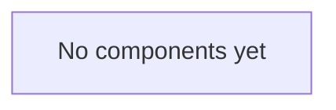

# Components

_Status: skeleton. Add a section per component as it is introduced._

For each component, record:

- **Responsibility:** what it owns, in one or two sentences.
- **Interfaces:** the APIs, events or files it exposes and consumes.
- **Data:** the data it stores or reads.
- **Design doc:** link to its doc in [docs/design/](../design/).

