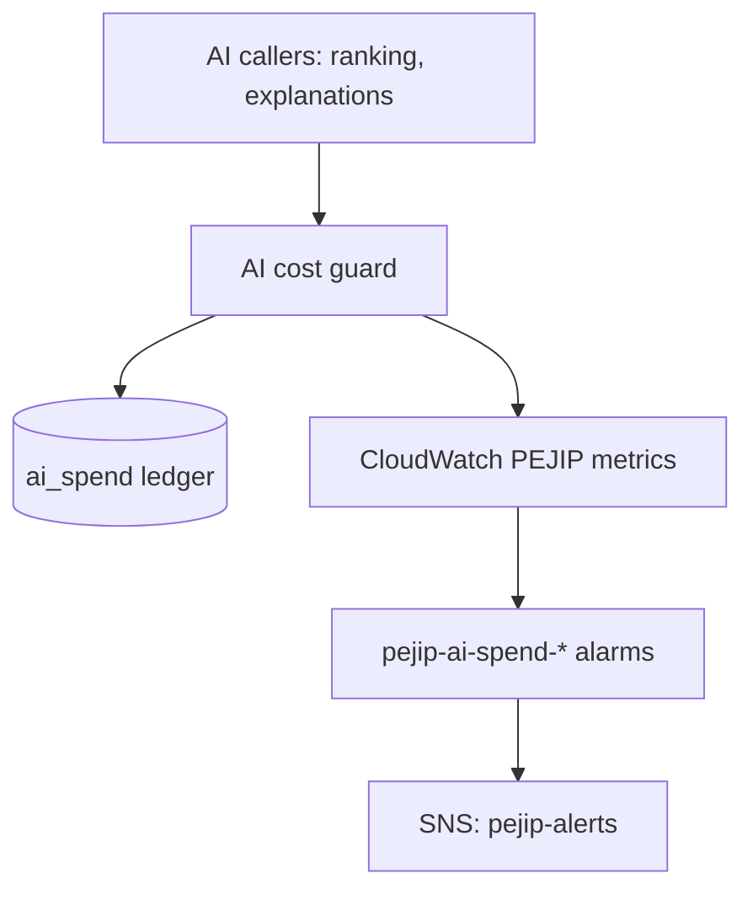

# Components

_Status: skeleton. Add a section per component as it is introduced._

For each component, record:

- **Responsibility:** what it owns, in one or two sentences.
- **Interfaces:** the APIs, events or files it exposes and consumes.
- **Data:** the data it stores or reads.
- **Design doc:** link to its doc in [docs/design/](../design/).

## AI cost guard

- **Responsibility:** enforces the $100 monthly Claude API cap before each call and
  records what each call cost (policy section 13).
- **Interfaces:** `pejip.cost.CostGuard.reserve(...)` returning a reservation that is
  settled with the API response's `usage`; raises `BudgetExceededError` at the cap.
  Publishes `PEJIP/AISpendMonthToDateUSD` and `PEJIP/AICallCostUSD` to CloudWatch.
- **Data:** the `ai_spend` SQLite table (feature, model, tokens, cost; no personal
  data) and the price table `src/pejip/cost/pricing.json`.
- **Design doc:** [0002: AI cost guard](../design/0002-ai-cost-guard.md).
