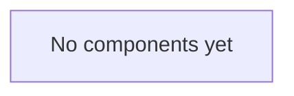

# Components

_Status: skeleton. Add a section per component as it is introduced._

For each component, record:

- **Responsibility:** what it owns, in one or two sentences.
- **Interfaces:** the APIs, events or files it exposes and consumes.
- **Data:** the data it stores or reads.
- **Design doc:** link to its doc in [docs/design/](../design/).

## Golden evaluation harness (`src/pejip/evaluation`)

- **Responsibility:** scores any ranking implementation against the labelled golden
  set and fails CI when a metric drops below the committed baseline.
- **Interfaces:** consumes a scorer callable (`EvalInput` in, `Prediction` out);
  exposes `python -m pejip.evaluation validate | run | ratchet`.
- **Data:** reads `eval/golden/` (synthetic cases and profile) and
  `eval/baseline.json`; writes an optional JSON report.
- **Design doc:** [0003: Golden evaluation set](../design/0003-golden-evaluation-set.md).
