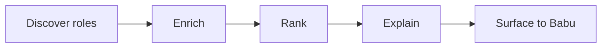

# Data flow

_Status: skeleton. Update whenever a source, store or pipeline step changes._

Describe how a role moves through the system, from discovery to a ranked,
explained recommendation, and where each piece of data is stored.

## Data stores

| Store | Holds | Owner component | Retention |
|---|---|---|---|
