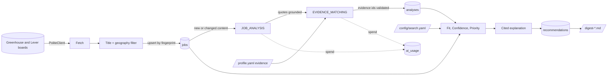

# Data flow

How a role moves from a company job board to a ranked, explained entry in the
digest. Detail is in [design doc 0003](../design/0003-find-thin-slice.md).

Only the profile's headline, target seniority, career direction and evidence items
leave the machine, sent to the Anthropic API for matching (see
[docs/SECURITY.md](../SECURITY.md)).

## Data stores

| Store | Holds | Owner component | Retention |
|---|---|---|---|
| `jobs` | Posting fields, pay, content hash, first and last seen | store (via pipeline) | 90 days after last seen |
| `analyses` | AI analysis and matching output, provenance | analysis (via pipeline) | 90 days |
| `recommendations` | Scores, components, reasons, explanation | scoring (via pipeline) | 90 days |
| `ai_usage` | Tokens and cost per call by feature and model | ai.client | 90 days |
| `runs` | Run status and per-source results | pipeline | 90 days |
| `profile.yaml` | Career profile (personal data, local file) | Babu | Babu's own file |
| `output/digest-*.md` | Digest per run | cli | Babu's own files |
