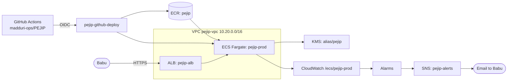

# System overview

_Status: skeleton. Fill in as the first components land._

## Purpose

PEJIP is a personal analyst that keeps finding executive and senior-leadership roles,
ranks which deserve attention, and explains why. It is not a generic job board.

## Context

## Quality attributes

Performance, security, reliability and accessibility targets, and how each is tested
(see the build policy, section 2).

## Deployment

PEJIP runs on AWS (account `275704950192`, `us-west-2`) as its own application,
isolated from the CyberSecurity-KRI dashboard; see
[ADR-0001](../adr/0001-aws-hosting-isolated-from-kri.md) and build policy section 5.1.
The foundation is Terraform in [infra/](../../infra/README.md): the adopted KMS key,
ECR repository `pejip`, the GitHub deploy and plan roles, the `pejip-alerts` topic and
the `pejip-monthly` budget. The VPC, ALB, ECS service and the certificate for
`job-search.zephyr-mcg.com` land with the first app code.

Neither CI nor the app holds a Claude API key: both swap a short-lived identity
token (GitHub Actions OIDC, or AWS STS for the ECS task role) for a short-lived
Claude token through Workload Identity Federation
([ADR-0004](../adr/0004-keyless-claude-access.md)).

