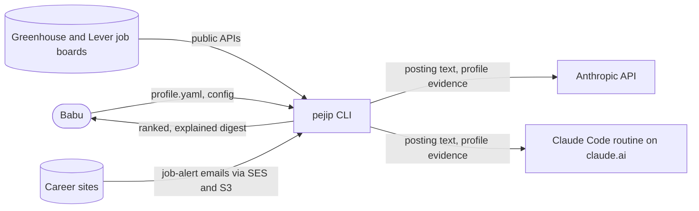
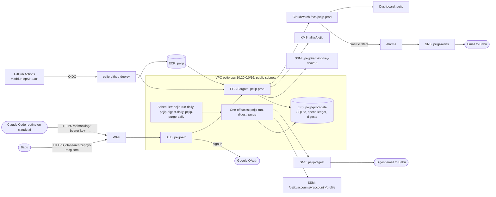

# System overview

_Last updated: 2026-10-05._

## Purpose

PEJIP is a personal analyst that keeps finding executive and senior-leadership roles,
ranks which deserve attention, and explains why. It is not a generic job board.

## Context

The first slice is a Python batch CLI that Babu runs locally
([ADR-0003](../adr/0003-python-cli-first-slice.md)). Each run fetches configured
company boards, filters roles by the search taxonomy and geography, has Claude
extract requirements and match them to profile evidence, computes Fit, Confidence
and Priority with deterministic rules, and writes a Markdown digest. See
[components.md](components.md) and [data-flow.md](data-flow.md).

## Quality attributes

- **Reliability:** a failed source or analysis never stops the run; it is shown in
  the digest's search health and unranked sections. Tested in
  `tests/integration/test_pipeline.py`.
- **Security and privacy:** personal data stays local except the minimum sent to the
  Anthropic API or the ranking routine; logs are redacted; 90-day retention. See
  [docs/SECURITY.md](../SECURITY.md).
- **Cost:** every AI call reserves its worst-case cost with the AI cost guard,
  which enforces the $100 monthly cap before the call is made. On AWS the
  ranking routine on Babu's plan does the analysis instead, with no API spend
  ([ADR-0008](../adr/0008-ranking-through-a-claude-code-routine.md)).
- **Quality:** deterministic scoring gated by the golden evaluation set.
- **Performance and accessibility:** the web portal is server-rendered with no
  script, uses real links and labelled controls, and stacks at phone width
  ([design 0013](../design/0013-web-portal.md)).

## Deployment

PEJIP runs on AWS (account `275704950192`, `us-west-2`) as its own application,
isolated from the CyberSecurity-KRI dashboard; see
[ADR-0001](../adr/0001-aws-hosting-isolated-from-kri.md) and build policy section 5.1.
Everything is Terraform in [infra/](../../infra/README.md): the adopted KMS key,
ECR repository `pejip`, the GitHub deploy and plan roles, the `pejip-alerts` topic,
the `pejip-monthly` budget, and the hosting stack from
[ADR-0005](../adr/0005-app-hosting-and-continuous-deploy.md): `pejip-vpc` with two
public subnets, ALB and WAF `pejip-alb` with the certificate for
`job-search.zephyr-mcg.com` (DNS records added by hand at the registrar), ECS
cluster and service `pejip-prod`, the daily `pejip-run-daily` (06:00 Pacific) and
`pejip-purge-daily` schedules, the EFS file system `pejip-prod-data` that holds the
SQLite database, the `pejip-digest` email topic
([ADR-0007](../adr/0007-sqlite-on-efs-and-a-scheduled-daily-run.md),
[design 0012](../design/0012-daily-run-and-storage.md)), the service alarms, the
search, error and stalled-run alarms and the `pejip` dashboard
([design 0011](../design/0011-monitoring.md)), and the job-alert inbox: SES receives
`alerts@inbox.job-search.zephyr-mcg.com` into the encrypted bucket
`pejip-inbox-275704950192` ([design 0010](../design/0010-job-alert-inbox.md)). Tasks sit in the public subnets without a NAT gateway; their
security group admits only the ALB. The ALB signs every request in with Google
except `/healthz` and the signed-out page, and the app admits only Babu's address
([ADR-0006](../adr/0006-google-sign-in-at-the-load-balancer.md)). The Deploy workflow builds and scans the image
on every pull request and ships `main` with a health gate and automatic rollback
([design 0005](../design/0005-app-hosting-and-deploy.md)). Releases are tagged
`vX.Y.Z` by the Release workflow, which also tags the release's image so ECR keeps
it; the Rollback workflow redeploys an earlier release's image through the same
health gate ([design 0006](../design/0006-releases-and-rollback.md)).

Neither CI nor the app holds a Claude API key: both swap a short-lived identity
token (GitHub Actions OIDC, or AWS STS for the ECS task role) for a short-lived
Claude token through Workload Identity Federation
([ADR-0004](../adr/0004-keyless-claude-access.md)).

