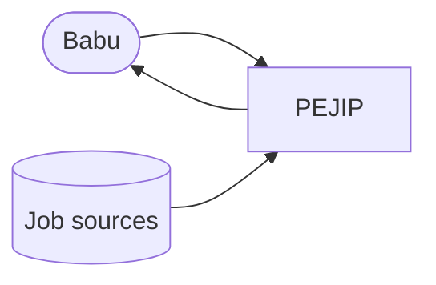

# System overview

_Status: skeleton. Fill in as the first components land._

## Purpose

PEJIP is a personal analyst that keeps finding executive and senior-leadership roles,
ranks which deserve attention, and explains why. It is not a generic job board.

## Context

## Quality attributes

Performance, security, reliability and accessibility targets, and how each is tested
(see the build policy, section 2).

## Deployment

Where the system runs, how it is deployed, and the infrastructure that backs it
(Terraform; see the build policy, section 5).
