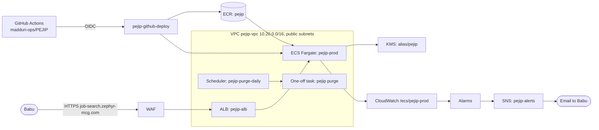

# System overview

_Status: skeleton. Fill in as the first components land._

## Purpose

PEJIP is a personal analyst that keeps finding executive and senior-leadership roles,
ranks which deserve attention, and explains why. It is not a generic job board.

## Context

## Quality attributes

Performance, security, reliability and accessibility targets, and how each is tested
(see the build policy, section 2).

## Deployment

PEJIP runs on AWS (account `275704950192`, `us-west-2`) as its own application,
isolated from the CyberSecurity-KRI dashboard; see
[ADR-0001](../adr/0001-aws-hosting-isolated-from-kri.md) and build policy section 5.1.
Everything is Terraform in [infra/](../../infra/README.md): the adopted KMS key,
ECR repository `pejip`, the GitHub deploy and plan roles, the `pejip-alerts` topic,
the `pejip-monthly` budget, and the hosting stack from
[ADR-0004](../adr/0004-app-hosting-and-continuous-deploy.md): `pejip-vpc` with two
public subnets, ALB and WAF `pejip-alb` with the certificate for
`job-search.zephyr-mcg.com` (DNS records added by hand at the registrar), ECS
cluster and service `pejip-prod`, the daily `pejip-purge-daily` schedule and the
service alarms. Tasks sit in the public subnets without a NAT gateway; their
security group admits only the ALB. The Deploy workflow builds and scans the image
on every pull request and ships `main` with a health gate and automatic rollback
([design 0005](../design/0005-app-hosting-and-deploy.md)).

