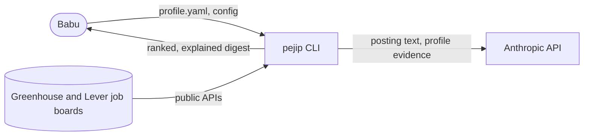

# System overview

_Last updated: 2026-10-05._

## Purpose

PEJIP is a personal analyst that keeps finding executive and senior-leadership roles,
ranks which deserve attention, and explains why. It is not a generic job board.

## Context

The first slice is a Python batch CLI that Babu runs locally
([ADR-0002](../adr/0002-python-cli-first-slice.md)). Each run fetches configured
company boards, filters roles by the search taxonomy and geography, has Claude
extract requirements and match them to profile evidence, computes Fit, Confidence
and Priority with deterministic rules, and writes a Markdown digest. See
[components.md](components.md) and [data-flow.md](data-flow.md).

## Quality attributes

- **Reliability:** a failed source or analysis never stops the run; it is shown in
  the digest's search health and unranked sections. Tested in
  `tests/integration/test_pipeline.py`.
- **Security and privacy:** personal data stays local except the minimum sent to the
  Anthropic API; logs are redacted; 90-day retention. See
  [docs/SECURITY.md](../SECURITY.md).
- **Cost:** the AI client enforces the $100 monthly cap before every call.
- **Quality:** deterministic scoring gated by the golden evaluation set.
- **Performance and accessibility:** targets are set with the API and web UI.

## Deployment

PEJIP runs on AWS (account `275704950192`, `us-west-2`) as its own application,
isolated from the CyberSecurity-KRI dashboard; see
[ADR-0001](../adr/0001-aws-hosting-isolated-from-kri.md) and build policy section 5.1.
The foundation is Terraform in [infra/](../../infra/README.md): the adopted KMS key,
ECR repository `pejip`, the GitHub deploy and plan roles, the `pejip-alerts` topic and
the `pejip-monthly` budget. The VPC, ALB, ECS service and the certificate for
`job-search.zephyr-mcg.com` land with the first app code.

