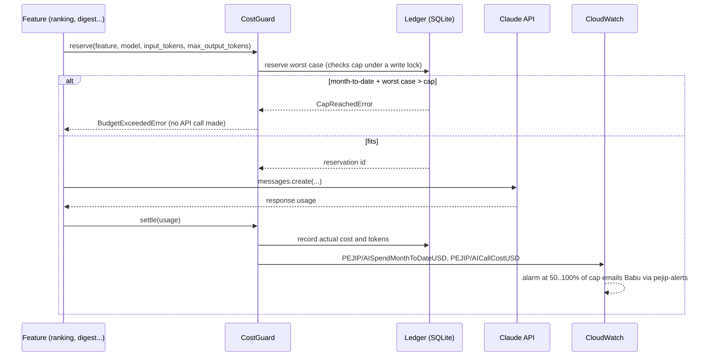

# 0001: AI cost guard

_Status: implemented. Last updated: 2026-10-05._

## Purpose

Keep PEJIP's Claude API spend under the **$100 monthly cap** and email Babu at
**50% of the cap and every 10% after** (build policy section 13). Every AI call in the
app goes through this one guard, so the cap can't be bypassed by a new feature and
the cost of each feature is visible.

## Scope

In scope:

- `src/pejip/cost/`: a stdlib-only Python package with the guard, the spend ledger,
  the price table and a CloudWatch publisher.
- `infra/ai_cost.tf`: six CloudWatch alarms (50, 60, 70, 80, 90 and 100%) that email
  through the existing `pejip-alerts` topic.

Out of scope:

- Making the API call. Callers keep using the Anthropic SDK directly; the guard
  wraps each call. The pipeline's own AI client is the expected single caller.
- The app's runtime IAM role. When the ECS task role lands it must allow
  `cloudwatch:PutMetricData` with the condition `cloudwatch:namespace = PEJIP`.
- Spend made outside PEJIP with the same API key (for example from the Console).
  A matching $100 monthly spend limit set in the Anthropic Console is the backstop
  for that, and for any bug in the guard.

## Design



- **Before the call**, the guard prices the worst case: input tokens at the 1-hour
  cache write rate (the dearest way an input token is billed) plus `max_tokens` of
  output. If month-to-date spend plus that would pass the cap, it raises
  `BudgetExceededError` and the call is never made. The check and the reservation happen
  in one SQLite write transaction, so concurrent workers can't overshoot together.
- **After the call**, `settle(response.usage)` replaces the reservation with the
  actual cost, read from `input_tokens`, `output_tokens`, the cache write breakdown,
  `cache_read_input_tokens` and web search requests. If the cache write breakdown is
  missing, writes are charged at the 1-hour rate.
- **On failure**, `release()` drops the reservation when the API rejected the request
  and nothing was billed. Leaving the `with` block without settling or releasing
  books the worst case, because a call that failed part way may have been billed.
  Spend is therefore overstated, never understated.
- **Months** are calendar months in UTC. The cap resets at 00:00 UTC on the 1st.
- **Essential calls** (`essential=True`) are recorded but not refused at the cap. No
  feature uses it today; any use needs a comment at the call saying why.
- **Alerts** are CloudWatch alarms on `PEJIP/AISpendMonthToDateUSD`
  (`Environment = prod`), one per threshold, `Maximum` over 5 minutes,
  `treat_missing_data = ignore` so a quiet day doesn't re-send an email. Each alarm
  fires once when spend first reaches its threshold in a month; when the next month's
  first call publishes a low value, the alarms return to OK silently. The guard also
  logs `ai_spend_threshold_crossed` (structured, no personal data) as each threshold
  is crossed, and `ai_call_refused` when it refuses a call.

## Interfaces

```python
from pejip.cost import BudgetExceededError, CloudWatchSpendMetrics, CostGuard, SqliteLedger

guard = CostGuard(
    SqliteLedger("/data/ai_spend.db"),           # persistent storage
    metrics=CloudWatchSpendMetrics(boto3.client("cloudwatch")),
)                                                # cap_usd defaults to 100

try:
    with guard.reserve(feature="ranking", model="claude-opus-5-5",
                       input_tokens=estimated_prompt_tokens, max_output_tokens=2048) as call:
        response = client.messages.create(model="claude-opus-5-5", max_tokens=2048, ...)
        call.settle(response.usage)
except BudgetExceededError:
    ...  # show the role as unranked (policy section 12), not a made-up result
```

| Call | Contract |
|---|---|
| `CostGuard.reserve(feature, model, input_tokens, max_output_tokens, essential=False)` | Returns a `Reservation`; raises `BudgetExceededError` at the cap, `UnknownModelError` for a model missing from the price table, `ValueError` for a bad feature name or negative counts. `feature` must match `[a-z][a-z0-9_-]{0,63}`. |
| `Reservation.settle(usage)` | Records the actual cost from an SDK `Usage` object or dict, returns it in USD. |
| `Reservation.release()` | Drops the reservation; use only when nothing was billed. |
| `CostGuard.month_to_date_usd()` / `breakdown()` | Spend this month; settled spend per feature and model. |
| `PriceTable.load()` | Prices from `src/pejip/cost/pricing.json`. |

`max_output_tokens` must equal the `max_tokens` sent to the API, and `input_tokens`
should be a high estimate (`client.messages.count_tokens` gives an exact count).

## Data model

SQLite table `ai_spend`, one row per call:

| Column | Meaning |
|---|---|
| `id`, `created_at`, `month` | Row id, UTC timestamp, budget month `YYYY-MM` |
| `feature`, `model`, `essential` | Which feature called which model |
| `status` | `reserved`, `settled` or `released` |
| `reserved_nanos`, `cost_nanos` | Worst-case and actual cost in nano-dollars (integers, summed exactly) |
| `input_tokens`, `output_tokens`, `cache_write_tokens`, `cache_read_tokens`, `web_search_requests` | Usage of a settled call |

No prompts, responses, profile fields or job text are stored, so the ledger holds no
personal data. The file must live on persistent storage: a ledger that resets
mid-month resets the cap with it.

**Prices** live in `src/pejip/cost/pricing.json` with a `version` date, in USD per
million tokens per model. A model that isn't listed is refused, so adding or
changing a model means adding its prices in the same PR (and stating its expected
monthly cost, policy section 13).

## Non-functional considerations

- **Reliability:** a CloudWatch failure is logged as `ai_spend_metrics_failed` and
  never fails the AI call (it does silence the email alerts until fixed). The cap
  itself never depends on CloudWatch.
- **Concurrency:** tested with four connections reserving against one file at once;
  they never exceed the cap together.
- **Security and privacy:** feature names are restricted identifiers so they can't
  carry personal data into the ledger, logs or metric dimensions; a test asserts the
  ledger file holds no response text.
- **Cost of the guard:** six alarms ($0.60/month) and a handful of custom metrics
  (about $0.30 each per month), inside the $50 AWS budget.
- Tests: `tests/unit/test_cost_*.py` and `tests/integration/test_cost_ledger.py`, 100% line and branch coverage.

## Alternatives considered

- **AWS Budgets:** can't see Anthropic billing, which isn't on the AWS bill.
- **Publishing to SNS from the app at each threshold:** needs its own de-duplication
  state and IAM to publish; CloudWatch alarms keep the alert rules in Terraform with
  the other alarms, as the policy asks.
- **Anthropic Usage and Cost Admin API:** reports spend after the fact and needs an
  admin key in the app; it can't stop a call before it is made. It remains useful
  for reconciling the ledger against the invoice.

## Open questions

- Reconciling the ledger with Anthropic's invoice each month (manual for now).
