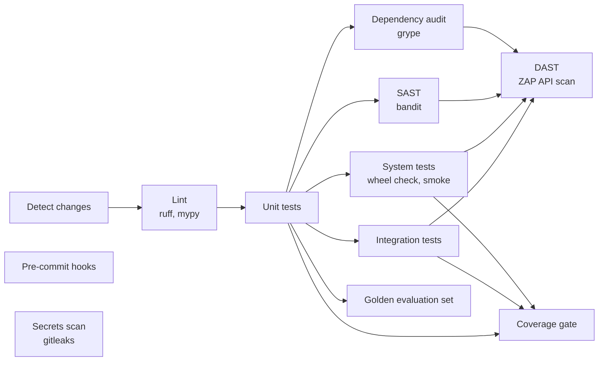

# 0001: CI pipeline and health endpoint

_Status: implemented. Last updated: 2026-10-05._

## Purpose

Give every Python change the gates the build policy requires, and give the deployed
service the health endpoint its load balancer and post-deploy gate poll. Decision
record: [ADR-0002](../adr/0002-python-toolchain-and-ci-gates.md).

## Scope

In scope: `.github/workflows/ci.yml`, the gate scripts in `ci/`, the `pejip.api`
app with `/healthz`, pre-commit and Dependabot for Python. Out of scope: deploy to
ECS (lands with the servers and load balancer), performance and accessibility
tests (added with the features they measure), CI failure email alerts.

## Design

Hooks and the secrets scan run on every change. The other jobs run when app code,
tests, gate scripts, `pyproject.toml`, the coverage baseline, `eval/` or the workflow change.

| Gate | Tool | Blocks on | Artifact |
|---|---|---|---|
| Lint | ruff, mypy `--strict` | any finding | log |
| Coverage | coverage.py | line < 100%, branch < baseline (min 95%), baseline lowered | `coverage-report` |
| Secrets | gitleaks, full history | any finding | `gitleaks-report` |
| SAST | bandit via `ci/severity_gate.py` | high | `sast-report` |
| Dependency audit | grype via `ci/severity_gate.py` | high, critical | `dependency-audit-report` |
| DAST | ZAP API scan via `ci/severity_gate.py` | high | `dast-report` |
| Build artifact | `ci/check_wheel.py` | non-`pejip` or dev/demo/test files in the wheel | `wheel` |
| Golden evaluation set | `python -m pejip.evaluation` ([0003](0003-golden-evaluation-set.md)) | invalid set; once a scorer is wired, any metric below `eval/baseline.json` | log |
| API smoke | `tests/system/test_api_smoke.py` | any GET route not returning 200 | `coverage-system` |

## Interfaces

- `GET /healthz` returns `200 {"status": "ok", "version": "<package version>"}`.
- Every response carries `SECURITY_HEADERS` from `pejip.api` and no `Server` header.
- `python -m pejip.api` serves on `PEJIP_HOST` (default `127.0.0.1`) and
  `PEJIP_PORT` (default `8000`); containers set `PEJIP_HOST=0.0.0.0`.
- Gate scripts: `python -m ci.coverage_gate [--base-baseline FILE] [--update]`,
  `python -m ci.severity_gate {bandit,grype,zap} REPORT`,
  `python -m ci.check_wheel WHEEL`. Each exits 1 when its gate fails.

## Data model

`.coverage-baseline.json`: `{"line": <percent>, "branch": <percent>}`. No
personal data.

## Non-functional considerations

- **Security:** the scanners above; the API sends a deny-all CSP and other
  hardening headers, verified by unit tests and the ZAP scan.
- **Reliability:** the smoke test starts the installed app as its own process.
- **Performance and accessibility:** no user-facing surface yet; tests come with it.

## Alternatives considered

- pip-audit for dependencies: no severity data, so it cannot block only on high and
  critical. Trivy: severity filters, but grype does the same with a simpler setup.
- Raising the coverage baseline automatically on `main`: CI cannot push to `main`,
  and a bot PR made with the workflow token does not trigger CI, so the PR that
  improves coverage raises the baseline itself.

## Open questions

- CI failure email alerts (policy section 6) are not wired yet.
