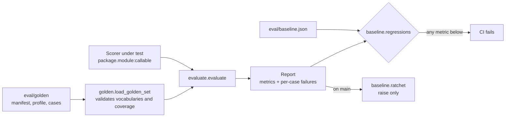

# 0003: Golden evaluation set

_Status: implemented. Last updated: 2026-10-05._

## Purpose

Rankings are only useful if they match what Babu would judge worth attention. Build
policy section 12 makes a committed test set the quality bar for every change to a
prompt, model, ranking logic or scoring weights; the FIND spec calls it the Golden
Evaluation Set (9.42, 17.31-17.34) and makes it a release gate (18.46). This feature
provides the set, a harness that scores any ranking implementation against it, and a
baseline that only goes up.

## Scope

In scope: the labelled cases and synthetic profile, the scorer contract, metrics,
the baseline ratchet, a CLI and the `Golden evaluation set` CI job (a required
check) that validates the set. The step that runs the scorer against the baseline
lands in that job with the scorer.

Out of scope: the scorer itself (the scoring pipeline owns it and plugs in through
the contract below), scope-inference and role-family accuracy metrics (labelled now,
measured once the scorer exposes them), and evaluation of live postings.

## Design

- Cases are TOML files read with the standard library, so the harness has no runtime
  dependencies. The loader collects every problem before failing, rejects labels
  outside the manifest's vocabularies, and fails if any spec category has no case.
- The scorer sees the posting, the network context and the profile, never the labels.
- A scorer exception or a wrong return type counts as unranked, matching the policy
  rule that a failed ranking is never shown as a made-up result.
- Cases marked `invariance_probe` are scored twice, the second time with a large
  network swapped in; Fit must not move (spec 9.8). `--fit-tolerance` allows a set
  drift for non-deterministic scorers and defaults to zero.
- Ranking quality is measured pairwise: every pair of cases whose labelled Fit ranges
  do not overlap must be ordered the same way by the scorer.

## Interfaces

- `pejip.evaluation.scorer.EvalInput(case_id, job, context, profile)` in, and
  `Prediction(fit, confidence, priority, positive_reasons, concerns, citations)` out.
  `priority` is `EXCLUDED` when a hard filter removes the role. `citations` are exact
  snippets of the posting the explanation relies on.
- CLI: `python -m pejip.evaluation validate | run | ratchet`, with `--scorer`,
  `--baseline`, `--report` and `--fit-tolerance`. Exit codes: 0 pass, 1 regression,
  2 invalid set, scorer or baseline.
- `eval/baseline.json`: set version, scorer, and a value per metric.

## Data model

See [eval/README.md](../../eval/README.md) for the case fields and metrics. All data
is synthetic: invented companies and an invented profile (policy section 10). A test
checks postings carry no email addresses, phone numbers or URLs.

## Non-functional considerations

- **Security and privacy:** synthetic fixtures only; no network access; scorers are
  imported only from a module path given on the command line.
- **Reliability:** scorer failures are contained per case and reported.
- **Performance:** 24 cases plus 3 probes means 27 scorer calls per run, so an AI
  scorer's run costs roughly 27 ranking calls. The scoring pipeline states that
  cost when it wires the run into CI (policy section 13).
- **Testing:** unit tests at 100% line and branch coverage, including an oracle
  scorer that must score 1.0 on every metric and adversarial scorers for each
  failure mode.

## Alternatives considered

- **JSON or YAML cases:** JSON is awkward for long postings and YAML adds a
  dependency; TOML is in the standard library and handles multi-line text well.
- **Exact Fit targets:** spec 17.32 allows ranges for AI-dependent interpretation, and
  exact targets would make the gate flaky.
- **A built-in keyword scorer as the baseline:** rejected, because a baseline set by a
  scorer that will never ship would gate the real one against the wrong bar.

## Open questions

- The labels are Claude's draft from the spec. Babu reviewed G17 (kept) and G22
  (raised) on 2026-10-05; the other cases can be reviewed the same way.
- Spec 17.34 also versions job fixtures, expected results and model versions
  separately; one set version covers them for now.
