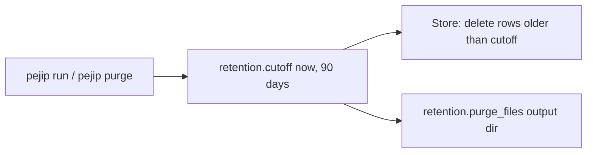

# 0004: Data retention

_Status: implemented; the store and CLI hooks landed with the first FIND slice (PR #16). Last updated: 2026-10-05._

## Purpose

Build policy section 10 keeps personal data, job postings and derived rankings for
**90 days** each, then deletes them. This feature is the one place that window is
defined, so no store or output can quietly keep data longer.

## Scope

In scope:

- `src/pejip/retention.py`: the 90-day window (`RETENTION_DAYS`, `cutoff`) and
  `purge_files`, which deletes expired files such as digests and exports.

Hooked up by the first FIND slice (PR #16): `Store.purge_expired` takes its cutoff
from `pejip.retention` and deletes expired jobs, analyses, recommendations and run
records at the start of every run and on `pejip purge`; both commands then run
`purge_files` on the digest output directory. `retention_days` in
`config/search.yaml` is validated to 1..90.

Out of scope here, and where it lands:

- A scheduled purge in the deployed service, so data expires even when no search
  runs. It comes with app hosting (ECS scheduled task calling `pejip purge` daily).
- Backups. None exist yet; when the deployed database gets snapshots or S3 copies,
  their retention is set to 90 days in Terraform in the same PR.
- The AI spend ledger (`ai_spend`). It holds feature, model, tokens and cost, no
  personal data, postings or rankings, so it is kept for spend history.

## Design

- A job posting expires 90 days after it was **last seen** in a source, so a role
  that is still open stays ranked. Analyses and rankings expire 90 days after they
  were created, and with their posting.
- The window can be shortened (for tests or a cautious run) but `cutoff` raises
  `ValueError` for anything above 90 days or below 1, so a config typo can't keep
  data longer than the policy allows.
- `purge_files` compares each file's modification time with the cutoff. It walks
  the directory without following symbolic links and never deletes one, so a purge
  can't reach outside the directory it was given. Directories are left in place.

## Interfaces

- `RETENTION_DAYS: int = 90`
- `cutoff(now: datetime, days: int = 90) -> datetime`: `now` must be
  timezone-aware; raises `ValueError` for `days` outside 1 to 90.
- `purge_files(directory: Path, now: datetime, days: int = 90) -> int`: returns
  the number of files deleted; a missing directory deletes nothing.

## Data model

No schema of its own. It acts on the stores listed in
[data flow](../architecture/data-flow.md).

## Non-functional considerations

- **Security and privacy:** the symlink rule stops a purge from deleting files
  outside its directory; the module logs nothing, so no file names reach logs.
- **Reliability:** idempotent; running it twice deletes nothing more.
- **Tests:** `tests/unit/test_retention.py` covers the window bounds, the
  boundary (exactly 90 days old is kept), nested files, shorter windows, symlinks
  and a missing directory.

## Alternatives considered

- Retention only in config (`retention_days` in `config/search.yaml`): rejected as
  the only guard, because a larger value would silently keep data longer.
- Database TTL features: not portable between SQLite and PostgreSQL.

## Open questions

None.
