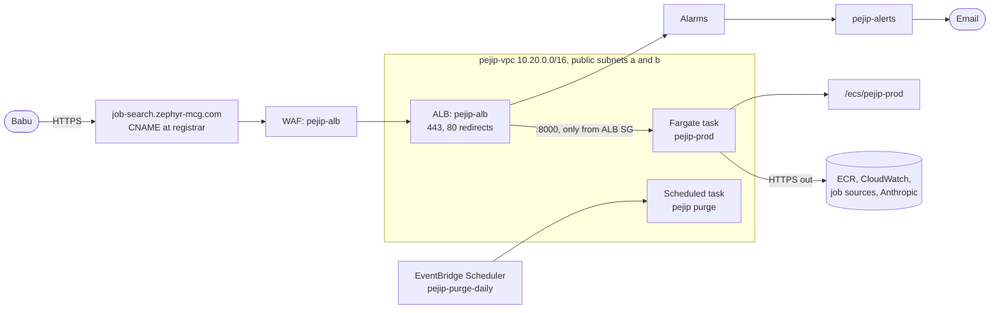
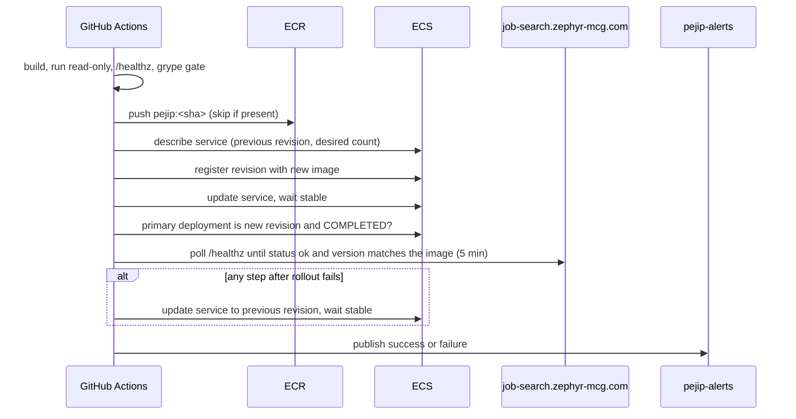

# 0005: App hosting and continuous deploy

_Status: implemented. Last updated: 2026-10-05._

## Purpose

Serve PEJIP at `https://job-search.zephyr-mcg.com` and ship every change merged to
`main` without a manual step, with a health gate, automatic rollback and email on
the result (build policy sections 5, 6 and 15). The decision record is
[ADR-0005](../adr/0005-app-hosting-and-continuous-deploy.md).

## Scope

In scope: the network, load balancer, certificate, firewall, ECS service, container
image, deploy workflow, service alarms and the daily retention purge schedule.

Out of scope: a hosted database and secrets (they land with the first feature that
stores data in the cloud), release tags and a manual rollback workflow (the
releases work), and authentication in front of feature endpoints.

## Design

Deploy sequence on `main`:

## Interfaces

- **Container:** `python -m pejip.api` by default, listening on `PEJIP_PORT`
  (8000) on `PEJIP_HOST` (`0.0.0.0` in the image). User `10001`, read-only root
  filesystem. Any `pejip` CLI command can run as a command override.
- **Health:** `GET /healthz` returns `{"status": "ok", ...}`. The ALB target group,
  the container `HEALTHCHECK`, the CI smoke test and the deploy health gate all use it.
- **Workflow:** `.github/workflows/deploy.yml`. Required check `Container image`;
  job `Deploy to production` on `main` and on manual dispatch. With input
  `image_tag` (a full commit SHA already in ECR), from `workflow_call` or manual
  dispatch, it skips the build and redeploys that image; this is how rollback
  redeploys an earlier release. Callers grant `id-token: write` and must not share
  the `deploy-refs/heads/main` concurrency group.
- **GitHub settings:** variables `AWS_DEPLOY_ROLE_ARN`, `DEPLOY_ENABLED` and
  optionally `APP_URL` (defaults to the production hostname).
- **Terraform outputs:** `certificate_validation_records`, `alb_dns_name`, `app_url`.

## Data model

No data is stored. Task definition revisions registered by the workflow are tagged
`Project = PEJIP` and `Commit = <sha>`. Log groups (`/ecs/pejip-prod`,
`/vpc/pejip-prod/flow-logs`, `aws-waf-logs-pejip`) are KMS-encrypted and kept 90
days. The task has no data access yet beyond publishing `PEJIP` metrics.

## Non-functional considerations

- **Security:** HTTPS only (TLS 1.2+), WAF managed rules, tasks unreachable except
  through the ALB, non-root read-only container, image scanned before it can
  deploy, least-privilege roles (`pejip-ecs-execution`, `pejip-ecs-task`,
  `pejip-scheduler`), checkov on all Terraform with inline-justified skips only.
- **Reliability:** ALB health checks, ECS circuit breaker with rollback, the
  workflow's own rollback on a failed health gate, and alarms on 5xx, unhealthy
  targets and missing tasks.
- **Cost:** about $35 to $40 a month (ADR-0005).
- **Testing:** every pull request that can change the image builds and smoke tests
  it; Terraform is linted, scanned and planned on every infra PR. The rollback path
  runs in production only today; a rehearsed rollback belongs to the releases work.

## Alternatives considered

See [ADR-0005](../adr/0005-app-hosting-and-continuous-deploy.md).

## Open questions

- When the app needs a database, decide between RDS PostgreSQL and a smaller store,
  and whether that justifies private subnets with NAT.
- Authentication in front of feature endpoints before any personal data is served.
