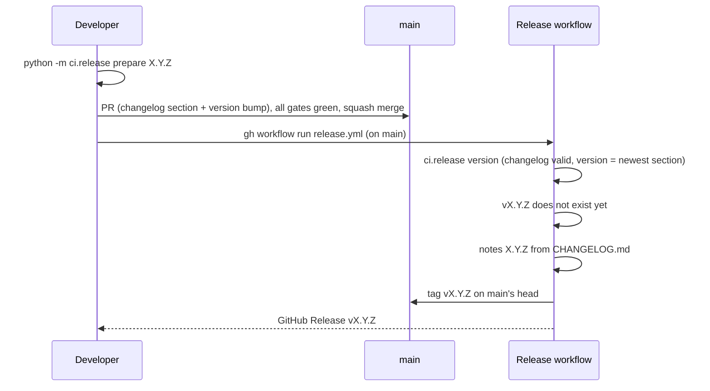

# 0006: Releases and rollback

_Status: implemented (versioning, changelog, releases, CI rollback drill); the
one-command production rollback lands with the deploy workflow. Last updated:
2026-10-05._

## Purpose

Build policy section 15 asks for semantic version tags, a changelog, and a rollback
to the previous release that is one documented command, is exercised in CI, and
runs automatically when the post-deploy health gate fails. This feature supplies the
version and changelog rules, the release workflow, the rollback target selection and
the CI rollback drill, and defines the interface the deploy workflow plugs into.

## Scope

In scope:

- `CHANGELOG.md` and its structure check.
- `ci/release.py`: version, changelog and tag checks, cutting a release, release
  notes, and choosing the rollback target.
- `.github/workflows/release.yml`: run on `main`, tags the release and publishes its
  GitHub Release.
- `ci/rollback_drill.py` and the **Rollback drill** CI job.

Out of scope here, and where it lands:

- Building and pushing images, the ECS service, the post-deploy health gate and the
  automatic rollback when it fails: the deploy workflow (app hosting and deploy).
- `.github/workflows/rollback.yml`, the one-command production rollback: added in
  the PR after the deploy workflow merges, because it calls that workflow (see
  [Rollback](#rollback)).
- Database migrations: none exist yet. When the first one lands, the drill is
  extended to run the previous release against the database migrated by the
  current build (see [Non-functional considerations](#non-functional-considerations)).

## Design

### Versions and the changelog

- Versions are `MAJOR.MINOR.PATCH` without pre-release suffixes. The version lives in
  one place, `pyproject.toml`; the app reads it from package metadata
  (`pejip.__version__`) and reports it on `GET /healthz`.
- `CHANGELOG.md` starts with `## Unreleased`, followed by releases newest first as
  `## X.Y.Z - YYYY-MM-DD`, each listing at least one change. The newest release is the
  version in `pyproject.toml`, so the two can't drift.
- `python -m ci.release check` enforces this. It runs as the `release-check`
  pre-commit hook, so it runs locally and in the **Pre-commit hooks** CI job on every
  change, docs-only ones included.

### Cutting a release



`prepare` refuses a version that is not newer than the current one and an empty
Unreleased section. The release workflow runs only on `main`, so only gated code is
released, and refuses a version that is already tagged. It creates the tag itself
rather than reacting to a pushed tag, for two reasons: the deploy role trusts only
`refs/heads/main`, so a later step that adds the `vX.Y.Z` tag to the release's ECR
image can run in the same job; and no one needs push rights for tags.

### Rollback

Continuous deploy ships every merge to `main`, so the live build is `main`'s head.
The rollback target is therefore:

- the release named by the operator, or else
- the newest release tag whose commit is not the live commit: the newest release when
  `main` is ahead of it, or the release before it when `main` is exactly a release.

`python -m ci.release rollback-target [--version X.Y.Z] --head SHA` prints the
target's `version` and commit `sha` in `GITHUB_OUTPUT` form.

Interface with the deploy workflow (proposed to the app hosting and deploy work; it confirms or adjusts this in its PR):

- Every image pushed from `main` is tagged with its full commit SHA (ECR tags are
  immutable), so a release's image is found from its tag's commit without retagging.
- The deploy workflow accepts `workflow_call` with an `image_tag` input, deploys that
  existing image and runs the post-deploy health gate. A failed health gate rolls back
  automatically inside the deploy workflow (ECS deployment circuit breaker with
  rollback, or redeploying the previous task definition).
- `rollback.yml` (follow-up PR) is `workflow_dispatch` on `main` with an optional
  `version` input. It runs `rollback-target`, then calls the deploy workflow with the
  target's commit SHA. That is the one documented command:

  ```sh
  gh workflow run rollback.yml            # previous release
  gh workflow run rollback.yml -f version=0.1.0
  ```

  The next merge to `main` deploys again, so a rollback holds until the fix merges.
- The ECR lifecycle policy (deploy work) keeps the last 100 images tagged `v*` and
  the last 10 of the rest. With the deploy workflow, the Release workflow gains a step
  that adds `vX.Y.Z` to the release's SHA-tagged image (re-putting its manifest with
  the deploy role), so release images survive and stay available to roll back to.

### Rollback drill

The **Rollback drill** CI job runs on every app change, after **System tests**:

1. Picks the rollback target for this commit with `rollback-target --fallback-parent`.
   Until the first release is tagged there is none, so the commit before this one
   stands in.
2. Builds the target's wheel from its commit in a separate worktree and installs it,
   and installs this build's wheel from the System tests job, each in its own venv.
3. `python -m ci.rollback_drill` serves this build until `/healthz` is healthy, swaps
   it for the target and checks it is healthy and reports the target's version, then
   rolls forward to this build and checks it again.

A failure in any step fails the job, which is a required check.

## Interfaces

- `python -m ci.release check | version | prepare X.Y.Z | check-tag vX.Y.Z | notes X.Y.Z |
  rollback-target [--version X.Y.Z] [--head SHA] [--fallback-parent]`; exit code 1 and
  a `::error::` annotation on any broken rule.
- `python -m ci.rollback_drill --current PY --previous PY --previous-version X.Y.Z
  [--port 8000] [--timeout 30]`.
- Tags `vMAJOR.MINOR.PATCH`, annotated or lightweight; other tags are ignored.
- `GET /healthz` returns `{"status": "ok", "version": "X.Y.Z"}` (existing).

## Data model

No stored data. `CHANGELOG.md`, the `pyproject.toml` version and git tags are the
release record.

## Non-functional considerations

- **Reliability:** rollback is exercised on every app change, not only when needed.
  Once the app has a database, each migration must work with the previous release
  (policy section 15), and the drill is extended to apply this build's migrations to
  a scratch database before starting the previous release on it.
- **Security:** the release workflow is the only job with `contents: write`, runs only
  on `main` and refuses a version that is already released. The release tooling runs git with
  fixed arguments and no shell.
- **Tests:** `tests/unit/test_release.py` covers every rule; the integration tests run
  rollback target selection against a real git repository and the drill against real
  app processes, including a build that exits, one that never gets healthy and one
  that ignores terminate.

## Alternatives considered

- Release automation tools (release-please, semantic-release): they need commit
  message conventions and more third-party code in the release path; a small script
  with tests is enough for one app.
- Retagging release images in ECR at release time: needs the deploy role in the
  release workflow. Resolving the image by commit SHA avoids that.
- Rolling back by reverting the commit: slower (a full CI run) and doesn't help when
  the previous release is the one that must run now.

## Open questions

None.
