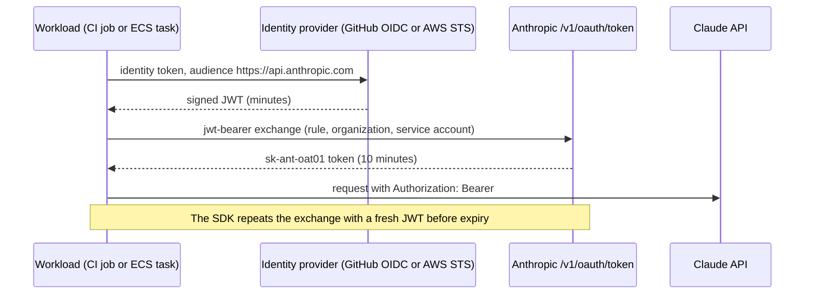

# 0007: Keyless Claude access

_Status: accepted. Last updated: 2026-10-05._

## Purpose

Let CI and the app call the Claude API without a long-lived API key, as build policy
section 5 requires. Decision record: [ADR-0004](../adr/0004-keyless-claude-access.md).

## Scope

In scope: the credentials module `pejip.claude_auth`, the AWS permissions in
`infra/claude_federation.tf` (including the policy attachment to the ECS task role
`pejip-ecs-task`), the `Claude federation` CI check, and the Console
setup. Out of scope: the AI client itself (it passes these credentials to the SDK)
and the ECS task definition (the hosting Terraform sets its environment).

## Design



`federation_credentials(env, sts=...)` reads `PEJIP_CLAUDE_IDENTITY`:

| Value | Identity token | Where |
|---|---|---|
| unset | none; the SDK's own resolution (`ant auth login`, a personal key) | a developer's machine |
| `github-actions` | GitHub Actions OIDC token, fetched fresh per exchange | CI jobs with `id-token: write` |
| `aws-sts` | `sts:GetWebIdentityToken`, RS256, 900 s, fetched fresh per exchange | the ECS task |

Callers build the client like this:

```python
kwargs = claude_auth.federation_credentials(os.environ, sts=boto3.client("sts"))
client = anthropic.Anthropic(
    credentials=anthropic.WorkloadIdentityCredentials(**kwargs) if kwargs else None
)
```

Fresh tokens on every exchange matter: Anthropic accepts each identity token's `jti`
once, so re-reading one token file on refresh would fail.

## Interfaces

Environment variables (all non-secret):

| Variable | Value |
|---|---|
| `PEJIP_CLAUDE_IDENTITY` | `github-actions` or `aws-sts` |
| `ANTHROPIC_ORGANIZATION_ID` | organization UUID (Console, Settings > Organization) |
| `ANTHROPIC_FEDERATION_RULE_ID` | `fdrl_...` for this workload |
| `ANTHROPIC_SERVICE_ACCOUNT_ID` | `svac_...` for this workload |
| `ANTHROPIC_WORKSPACE_ID` | optional `wrkspc_...`; only needed if a rule spans several workspaces |

`ANTHROPIC_API_KEY` and `ANTHROPIC_AUTH_TOKEN` must be absent wherever
`PEJIP_CLAUDE_IDENTITY` is set; `federation_credentials` raises `ClaudeAuthError`
otherwise.

The CI IDs (rule `pejip-ci-pull-requests`, service account `pejip-ci`) are written
into the workflows that federate, since they are not secrets. Terraform
outputs: `claude_federation_issuer_url`, `claude_federation_policy_arn`.

### Anthropic resources (Claude Console, Settings > Workload identity)

| Resource | CI (GitHub Actions) | App (AWS) |
|---|---|---|
| Issuer | `https://token.actions.githubusercontent.com`, discovery | `claude_federation_issuer_url` output, discovery |
| Service account | `pejip-ci` | `pejip-app` |
| Rule match | owner `madduri-ops` (numeric ID 289717107), repository `PEJIP`, event `pull_request`, any ref | `subject_prefix` = the ECS task role ARN (exact) |
| Rule `audience` | `https://api.anthropic.com` | `https://api.anthropic.com` |
| Scope, lifetime | `workspace:developer`, 600 s | `workspace:developer`, 600 s |
| Workspace | Default | Default |

The CI rule matches pull request runs only, because the live evaluation runs on pull
requests. The repository is public, but only pull requests from branches in this
repository can authenticate: GitHub never grants `id-token: write` to `pull_request`
runs from forks, so a fork cannot obtain a token for this rule. The rule matches
GitHub's subject format with immutable IDs
(`repo:madduri-ops@289717107/PEJIP@1404604379:pull_request`); the plain
`repo:madduri-ops/PEJIP:...` form never matches this repository's tokens.

## Data model

None. No token is stored or logged; the SDK caches the Claude token in memory.

## Non-functional considerations

- **Security:** no static credential anywhere; tokens last minutes. The AWS policy
  only allows the Anthropic audience, RS256 and at most 900 seconds. Errors never
  include token values (unit-tested).
- **Reliability:** each identity fetch has a 10-second timeout and fails with
  `ClaudeAuthError`; the SDK refreshes two minutes before expiry and keeps the old
  token if a refresh fails early.
- **Cost:** none. The `Claude federation` CI check only lists models, which is free.
- **Tests:** `tests/unit/test_claude_auth.py` covers every branch; the CI check proves
  the real GitHub-to-Anthropic exchange on pull requests that touch this feature.

## Alternatives considered

- **Keep rotating API keys:** a long-lived secret, against policy section 5.
- **API key in AWS Secrets Manager:** still a long-lived key to rotate, and one more
  secret for the app to read.
- **Token file written once per job:** simplest in CI, but refreshes would re-send the
  same `jti` and fail on longer jobs.

## Open questions

- `AIClient` and the CI live evaluation use these credentials. The old
  `ANTHROPIC_API_KEY` secret and Console key are deleted once the live evaluation runs
  green without them.
- The app's `aws-sts` path needs an STS client (`boto3`), which is not yet a
  dependency; until it is added, `AIClient` refuses to start with
  `PEJIP_CLAUDE_IDENTITY=aws-sts` instead of falling back to a key.
