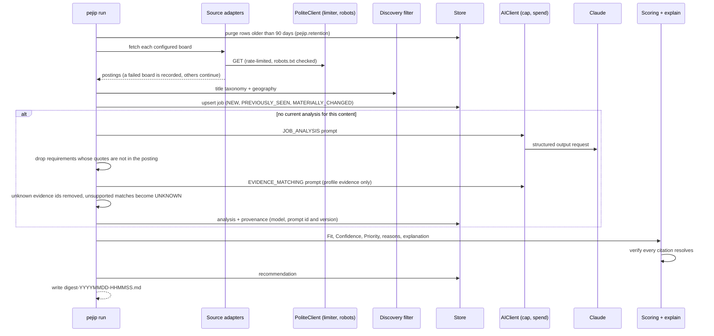

# 0008: FIND thin slice (discover, rank, explain)

_Status: implemented. Last updated: 2026-10-05._

## Purpose

Give Babu a working analyst now: find senior-leadership roles on company job
boards, decide which deserve attention, and explain why with evidence, following
the FIND specification's separation of Fit, Confidence and Priority.

## Scope

In scope: Greenhouse and Lever company boards, title and geography filtering,
AI job analysis and evidence matching, deterministic scoring, cited explanations,
a Markdown digest, retention, export and deletion, scored against the golden
evaluation set.

Out of scope for this slice: aggregators and other source classes, LinkedIn
connections (the digest says network data is not imported), feedback and learned
preferences, notifications, the API, the web UI and scheduled runs in AWS.

## Design

### Scoring

- **Fit (0 to 100)** is a weighted mean of six components (spec 9.6) using the
  weights in `config/search.yaml`. Each requirement-based component is the mean
  match strength of its requirements weighted by importance (CORE 3, IMPORTANT 2,
  SUPPORTING 1, MINOR 0.5) and classification (REQUIRED 1, PREFERRED 0.6, other
  0.4). UNKNOWN matches are left out, not scored as zero. Seniority is the lower of
  the scope requirements and how the inferred level compares with the target
  levels, so meeting a junior role's scope does not make it a fit. Each distinct
  negative-fit signal (quota, hands-on coding, and so on) and each CORE, REQUIRED
  requirement with NO_MATCH subtracts a configured penalty. Network, freshness, pay
  and location never affect Fit.
- **Confidence** starts at 1.0 and loses points for missing posting information,
  requirements the profile cannot judge, low analysis confidence, ambiguity and
  mostly-unknown components. HIGH at 0.75 and above, MEDIUM at 0.5.
- **Priority** combines Fit with freshness, pay fit and location fit (unknowns left
  out), then bands it. A band also needs a minimum Fit, IMMEDIATE needs a posting
  no older than three days, and LOW confidence caps Priority at MEDIUM. A pay below
  a minimum marked as a hard filter excludes the role.

### Explanations

Built from the validated data, never generated after the fact. Each point cites a
posting quote, a profile evidence id or a stored job field, and
`verify_citations` rejects any citation that does not resolve.

## Interfaces

- CLI: `pejip run | purge | export <file> | delete-all --yes`.
- Environment: `PEJIP_CONFIG`, `PEJIP_PROFILE`, `PEJIP_DATABASE_URL`,
  `PEJIP_OUTPUT_DIR`, `PEJIP_AI_LEDGER` (default `pejip-ai-spend.db`; keep it on
  persistent storage, since a fresh ledger restarts the month's spend at zero),
  and Claude credentials (`PEJIP_CLAUDE_IDENTITY` and the federation IDs from
  [0007](0007-claude-identity-federation.md), or `ANTHROPIC_API_KEY` locally).
- Files: `config/search.yaml` (sources, taxonomy, geography, AI, scoring),
  `profile.yaml` (see `examples/profile.example.yaml`), prompts in
  `src/pejip/prompts/<name>.v<N>.md`.

## Data model

| Table | Holds |
|---|---|
| `jobs` | One row per source posting: identity fingerprint, posting fields, pay, content hash, first and last seen |
| `analyses` | AI analysis and matching payloads per content hash, status OK or FAILED, provenance |
| `recommendations` | Fit, Confidence, Priority, components, reason codes, explanation, scoring version, one row per run |
| `runs` | Status (SUCCESS, PARTIAL, FAILED) and per-source results |

## Non-functional considerations

- **Cost:** two Claude calls per new or changed role, about 4k input tokens and
  3k to 6k output tokens (thinking included), roughly $0.10 to $0.15 per role at
  Opus 5.5 prices. Analyses are reused until a posting changes, so steady state is
  the new roles each day: at 5 to 10 a day, about $15 to $45 a month. The 40-role
  per-run limit bounds a busy day. Every call reserves its worst case (16,000 output
  tokens, about $0.33) with the AI cost guard, which refuses it once the $100
  monthly cap would be passed; remaining roles then show as unranked. Running as a
  local CLI, the guard's 50%-and-up alerts are log lines; the CloudWatch metrics
  that email Babu are wired when the pipeline runs in AWS.
- **Reliability:** source failures and analysis failures are isolated and shown in
  the digest; a failed analysis is retried on the next run.
- **Security and privacy:** see [docs/SECURITY.md](../SECURITY.md).
- **Quality:** 100% line and branch coverage. `pejip.golden_eval` scores the golden
  evaluation set (design doc 0003) with this pipeline: from the model output recorded
  in `eval/recordings/` on every change, and by calling the model when prompts, the
  AI client, the analysis code or the AI config change.

## Alternatives considered

See [ADR-0003](../adr/0003-python-cli-first-slice.md).

## Open questions

- Covering Babu's target companies that have no allowed public API (Google, NVIDIA,
  Meta, Micron, Microsoft, and most of OpenAI's roles): job-alert emails or a
  licensed job-data provider. `config/search.yaml` searches Anthropic only for now.
- Model answers vary between runs (two live runs of the same code scored 67% and
  46% Fit in range), so the live job gates only the hard rules (`--gate invariants`,
  Babu's choice on 2026-10-05) and the replay of committed recordings gates the
  rest. Making the analysis more stable from run to run is open work.
