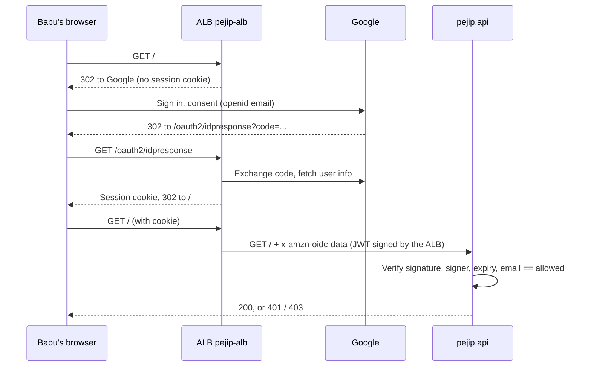

# 0009: Google sign-in

_Status: implemented. Last updated: 2026-10-06._

## Purpose

Only Babu may use `https://job-search.zephyr-mcg.com`. They sign in with their
Google account; every other account, and every request that does not come
through the load balancer, is refused. Decision record:
[ADR-0006](../adr/0006-google-sign-in-at-the-load-balancer.md).

## Scope

In scope: Google sign-in on every route except `/healthz` and the signed-out page,
one allowed address, sign-out, tests and DAST with sign-in on, the Terraform and
setup steps.

Out of scope: more than one user, roles, signing out of Google itself, sign-in for the
batch commands (they run as ECS tasks, not over HTTP).

## Design

`/healthz` matches a listener rule ahead of sign-in and goes straight to the app,
which also skips the check for it.

**Sign out.** The sidebar's Sign out button posts to `/signout` (signed in like any
route). If the session has already expired, the load balancer redirects that post
to Google's sign-in page, so the page policy's `form-action` allows
`https://accounts.google.com` (browsers apply it to redirects, and would otherwise
drop the click silently), and `/signout` also answers the GET that Google sends
the browser back with. The app answers 303 to `/signed-out` and expires every
`AWSELBAuthSessionCookie-N` shard the browser sent, always including `-0`
(`Max-Age=0`, `Path=/`, `Secure`, `HttpOnly`), which is how AWS says to end an ALB
session. Google has no sign-out endpoint for one site, so Babu stays signed in to
Google itself, and the page says so. `/signed-out` and `/portal.css` match a
second listener rule ahead of sign-in (`aws_lb_listener_rule.signed_out`), or the
next request would sign Babu straight back in; the page shows no data. "Sign in
again" goes to `/`, which starts a fresh sign-in.

The app fetches the ALB's public key for the token's `kid` from
`https://public-keys.auth.elb.us-west-2.amazonaws.com/<kid>` once and keeps it in
memory (at most 16 keys).

## Interfaces

- **App settings (environment):** `PEJIP_AUTH_ACCOUNTS` (the account registry,
  `id=email` pairs, [0016](0016-accounts.md); `PEJIP_AUTH_ALLOWED_EMAIL` alone
  still works as account `babu`), `PEJIP_AUTH_ALB_ARN` (both set by the ECS task
  definition), and
  `PEJIP_AUTH_KEY_URL` (key URL template with `{kid}`; tests only).
- **Responses:** 401 `{"detail": "sign-in required"}` without a valid ALB token,
  403 `{"detail": "this account is not allowed"}` for another or unverified
  account, 503 `{"detail": "sign-in is not configured"}` when the settings are
  missing. All carry the usual security headers.
- **Terraform:** SSM parameters `/pejip/google-oauth/client-id` and
  `/pejip/google-oauth/client-secret` (created by hand); variables
  `sign_in_email` (sensitive, defaults to `alert_email`), `sign_in_accounts`
  (sensitive, [0016](0016-accounts.md)) and
  `sign_in_session_seconds` (default 43200); output `google_redirect_uri`.
- **CI helper:** `python -m ci.alb_token KEY_DIR EMAIL ALB_ARN` writes a
  throwaway public key and prints a token signed with it.

## Data model

None stored. The signed-in address is compared in memory and never logged.
Google receives the sign-in itself (Babu's own account); the app only receives
the address and Google's subject ID from the ALB.

## Non-functional considerations

- **Security:** signature (ES256, P-256 only), signer ARN, expiry (60 s skew),
  verified email and exact address are all checked; key IDs are validated before
  they are put in a URL. Unit tests cover each refusal; integration and system
  tests run the app over HTTP with sign-in on; the system smoke test checks every
  protected route answers 401 without a token and 403 for another account.
- **DAST:** ZAP scans with sign-in on and a valid token on every request; the job
  fails if any request was refused sign-in, so the scan always reaches the routes.
- **Reliability:** a key fetch happens once per key; if AWS's key endpoint is
  down on first use, requests get 401 until it answers. `/healthz` never depends
  on sign-in.
- **Performance:** one ECDSA verification per request (well under a millisecond).

## Setup

Babu's one-time steps (Google Cloud OAuth client, SSM parameters, apply) are in
[infra/README.md](../../infra/README.md#google-sign-in).

## Alternatives considered

See [ADR-0006](../adr/0006-google-sign-in-at-the-load-balancer.md).

## Open questions

- Add a sign-out route that clears the ALB session cookies once the app has pages.
