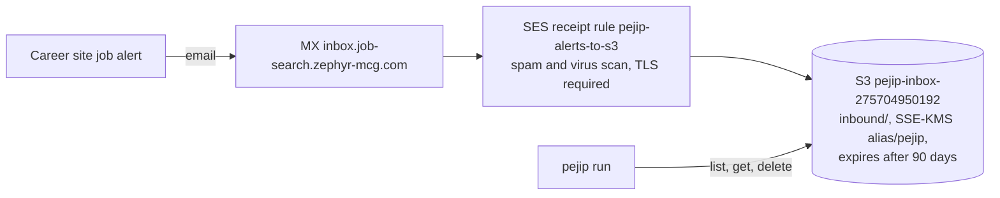

# 0010: Job-alert inbox

_Status: accepted; receiving is on, and `pejip run` reads the inbox when `PEJIP_INBOX_BUCKET` is set. Last updated: 2026-10-05._

## Purpose

Babu's target companies are Google, NVIDIA, Meta, Micron, Anthropic, OpenAI and
Microsoft. Only Anthropic publishes its roles through an API whose terms allow
automated access (`docs/sources.md`). The others run their own or Workday career
sites, and OpenAI's public feed lists only a few of its roles. Every one of them
offers job-alert emails for a saved search, so PEJIP gets its own address to
receive those alerts and turns them into roles to rank.

## Scope

In scope:

- An SES-received address, `alerts@inbox.job-search.zephyr-mcg.com`, that Babu
  uses to sign up for each site's job alerts.
- An encrypted bucket that keeps each received message for at most 90 days.
- Read and delete access for the app's task role.
- Reading and parsing the messages (`pejip.sources.email_alerts`) into roles.

Out of scope here:

- Running `pejip run` on a schedule in AWS, with a persistent store; until then the
  inbox is read wherever `pejip run` runs with `PEJIP_INBOX_BUCKET` and AWS
  credentials that the bucket's key allows.
- Fetching each alert's linked posting for its full description, which is checked
  per site against its robots.txt and terms before any adapter fetches it.
- Babu's own logins on the career sites: never used (site terms, the policy's ban
  on login-walled pages, and the risk of flagging his accounts).
- Gmail API or IMAP access to a personal mailbox: rejected, as both need a
  long-lived token or password (policy section 5) and expose the whole mailbox.

## Design

- The receiving domain is a subdomain of the app's host name. The host name is a
  CNAME to the load balancer, and DNS does not allow an MX record beside a CNAME.
- SES writes each message whole (MIME) under `inbound/`. The bucket encrypts with
  the PEJIP key, which lets SES generate data keys only through S3 and only for
  this account.
- The bucket accepts writes only from SES rules in the `pejip-inbox` rule set,
  denies anything without TLS and blocks public access.
- SES allows one active receipt rule set per account and region. The rule set is
  activated only when `inbox_receiving_enabled = true`, after checking that
  nothing else in the account uses SES receiving in `us-west-2`.

### Reading the inbox

`pejip run` lists `inbound/`, parses each message with the standard library's
`email` package and deletes it once its roles are stored.

- The HTML part is preferred over plain text. Each link is followed through
  click-tracking wrappers (a URL carried in a query parameter, up to three deep),
  and tracking parameters (`utm_*` and similar) are dropped, so one role has one id.
- A link becomes a role only when it points at a careers page configured for that
  company (`inbox.companies` in `config/search.yaml`, `host/path-prefix` patterns).
  Its text is the title, and the text after it (up to six short lines) is the
  location and the description. Links that name an action ("View job", "Apply")
  or a confirmation are not roles.
- The roles then go through the same title and geography filter, analysis and
  scoring as board postings. An alert carries little text, so analysis usually
  rates Confidence low until the linked page can be read.
- An email that lists no roles, such as a sign-up check, becomes a digest note
  with its sender, subject and any confirm or verify links, so Babu can finish the
  sign-up from the digest. PEJIP never opens those links itself.
- Messages are never logged, only counts. A failure to list, read or delete marks
  the inbox FAILED in the digest's search health; the boards still run, and an
  unread message stays in the bucket for the next run.
- S3 access uses `boto3`, Amazon's SDK (approved by Babu on 2026-10-05), behind a
  small typed protocol so tests use an in-memory fake.

## Interfaces

- Address: `alerts@inbox.job-search.zephyr-mcg.com` (Terraform output `inbox_address`).
- DNS at the registrar (output `inbox_dns_records`): a TXT record
  `_amazonses.inbox.job-search` for domain verification, and an MX record
  `inbox.job-search` with value `10 inbound-smtp.us-west-2.amazonaws.com`.
- Configuration: `PEJIP_INBOX_BUCKET` (bucket name; unset means no inbox) and
  `AWS_REGION`; `inbox.companies` in `config/search.yaml`.
- Task role `pejip-ecs-task`: `s3:ListBucket` on `inbound/`, `s3:GetObject` and
  `s3:DeleteObject` on `inbound/*`, and `kms:Decrypt` through S3.

## Data model

Messages are raw MIME objects at `inbound/<SES message id>`. They can hold Babu's
name and the alert's search terms, so the bucket is tagged
`DataClassification = personal`. A message is deleted after it is read, and the
lifecycle rule removes any message left after 90 days, plus deleted versions after
one day.

## Non-functional considerations

- **Privacy (policy section 10):** encrypted at rest with the PEJIP key and in
  transit (TLS required for delivery and for reads), 90-day expiry, no access
  logs that would copy the data elsewhere. AWS is already PEJIP's host, so no new
  third party receives personal data.
- **Security:** checkov runs on every infra change; the three skipped bucket
  checks (access logs, cross-region replication, event notifications) are
  documented in `inbox.tf`.
- **Cost:** SES receiving is $0.10 per 1,000 emails plus a little S3; a few
  alerts a day costs well under $1 a month.

## Alternatives considered

- Forwarding from a mailbox at Babu's email provider: works, but adds a mailbox
  and a forwarding rule for no gain. Babu chose signing up with PEJIP's address
  directly (2026-10-05).
- Gmail API, IMAP, or logging in to the career sites: rejected above.
- A licensed job-data provider: possible later; costs money and needs its own
  terms review.

## Open questions

- Which sites' posting pages may be fetched for full descriptions.
- Whether each site's alert links match the configured patterns; they are the
  sites' public job URLs and get adjusted once real alerts arrive.
- The hosted app still needs a persistent store and a scheduled `pejip run`
  before inbox roles are ranked in AWS.
