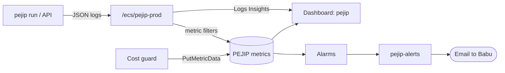

# 0011: Monitoring and alerts

_Status: accepted. Last updated: 2026-10-05._

## Purpose

Tell Babu by email when the job search stops working, and give one place to see
how searches, errors and Claude spend are doing (build policy section 14:
"alarms on error rate, failed fetch runs and stalled pipelines").

## Scope

In scope: alarms for failed search runs, failed job sources, logged errors and a
stalled daily search; a CloudWatch dashboard `pejip` that shows those, the Claude
spend and every PEJIP alarm.

Already covered elsewhere and only shown on the dashboard: Claude spend alarms at
50% to 100% of the cap ([design 0002](0002-ai-cost-guard.md), `infra/ai_cost.tf`),
the AWS budget (`infra/alerts.tf`), and the hosting alarms for 5xx, unhealthy
targets, missing tasks, CPU and memory (`infra/alarms.tf`).

Out of scope: distributed traces, paging or SMS, and the scheduled daily search
itself (built in the "Database and daily search run" work).

## Design

The app already writes one JSON line per event to `/ecs/pejip-prod`
([logs](../architecture/components.md#logs)). CloudWatch log metric filters turn
those lines into metrics in the `PEJIP` namespace, so the app makes no extra
AWS calls and a run's metrics can't be lost to a CloudWatch API error.

| Metric | Log lines counted |
|---|---|
| `SearchRunsSucceeded` | `event = run_finished`, `status = SUCCESS` |
| `SearchRunsPartial` | `event = run_finished`, `status = PARTIAL` |
| `SearchRunsFailed` | `event = run_finished`, `status = FAILED` |
| `SourceFailures` | `event = source_failed` |
| `AppErrors` | `level = ERROR` or `CRITICAL` |

`pejip run` now logs `run_crashed` at ERROR (with the exception type, never its
message) when the run raises, so a crash before `run_finished` still counts.

Alarms (all email through `pejip-alerts` on entering ALARM):

| Alarm | Fires when |
|---|---|
| `pejip-search-run-failed` | A run finished FAILED (every source failed) |
| `pejip-source-failures` | Any source failed to fetch in the hour (the run is PARTIAL) |
| `pejip-app-errors` | Any ERROR line in the hour |
| `pejip-search-stalled` | No run finished SUCCESS or PARTIAL for 26 hours; also emails when it clears |

`pejip-search-stalled` treats missing data as breaching, so it would fire from
the moment it exists. It is created only when `search_run_alarms_enabled = true`,
which is set once the daily search schedule is live.

The dashboard has six widgets: search runs per day by outcome, a Logs Insights
table of source failures by source, Claude spend this month against the cap,
errors per hour (logged errors, source failures, app 5xx), the 20 most recent
error lines (time, event, error type, run id) and the state of every PEJIP alarm.
`terraform output dashboard_url` prints its link.

## Interfaces

- Log events the filters depend on: `run_finished` with `status`,
  `source_failed`, and the `level` field. `tests/unit/test_monitoring_events.py`
  fails if an event is renamed in the code without updating the filters.
- Terraform variable `search_run_alarms_enabled` (default `false`).
- Terraform output `dashboard_url`.
- The GitHub plan role can read dashboards and metric filters.

## Data model

No schema change. Metrics hold counts only; the dashboard's log tables show the
event name, source name (a company and adapter), error type and run id, all of
which the redaction layer already allows in logs.

## Non-functional considerations

- **Cost:** about $2 a month: five filter metrics at $0.30, five alarms at $0.10
  (the stalled alarm reads two metrics), the dashboard is within the free three,
  and Logs Insights scans only when the dashboard is opened.
- **Privacy:** no new data leaves the app; metric filters read lines that are
  already redacted (policy section 14).
- **Noise:** one email per alarm per incident. A source that stays broken emails
  once a day, after each daily run, which is the reminder we want.
- **Testing:** a unit test proves a crashed run logs `run_crashed` at ERROR and
  still exits with the error; another ties every filter to an event the code
  logs. Terraform lint, checkov and plan run in the Infra workflow.

## Alternatives considered

- Publishing run metrics with `PutMetricData` from the app: more code and a
  boto3 call in every run, and a crash would publish nothing. Log filters give
  the same metrics from lines we already write.
- A per-source metric dimension: about $0.30 a month per source; the Logs
  Insights table names the failing source for free.
- AWS/Billing estimated charges on the dashboard: needs billing alerts in
  us-east-1; the `pejip-monthly` budget already emails on AWS spend.

## Open questions

- Uvicorn's own error lines are plain text, not JSON, so API exceptions are
  caught by the `pejip-app-5xx` alarm rather than `pejip-app-errors`.
