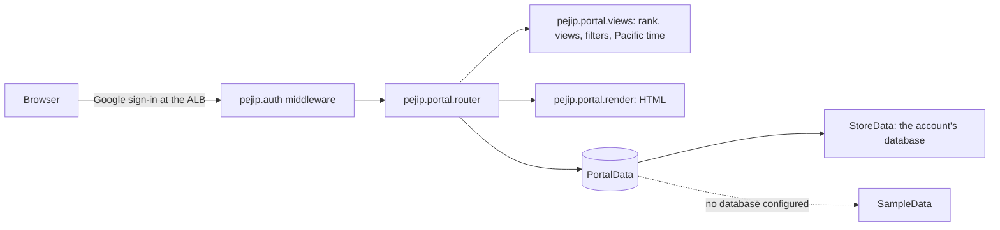

# 0013: Web portal (Home, Opportunities, Opportunity detail, Companies, Watchlist, Connections, Search Health, Settings)

_Status: implemented. Last updated: 2026-10-06._

## Purpose

Give Babu a signed-in web view of the ranked roles at `job-search.zephyr-mcg.com`
instead of only the Markdown digest: what needs attention now, every active
opportunity with saved views and filters, and one role's full, cited explanation
(spec section 12).

## Scope

In scope: the Home, Opportunities, Opportunity detail, Companies, Watchlist,
Search Health and Settings pages from the portal mocks (`Main`, `Opportunities`,
`Opportunity`, `Companies`, `Watchlist`, `SearchHealth` and `Settings` boards on the shared mock canvas, style
guide in the project files), served by the existing FastAPI app behind Google
sign-in, reading each signed-in account's own database through a data interface
(synthetic sample data when no database is configured, as in local runs).

Out of scope for now:

- Reason codes and comments on decisions (spec 10.3), Great match and Archive,
  watching a company, "This explanation is wrong", and "Search now": they need more
  storage and a run trigger. The pages leave them out rather than show buttons that
  do nothing.
- On Connections, uploading an export, answering "Your call" titles and unresolved
  employers on the page, relationship strength entry, the referral goal tracker and
  import history: they need storage. Imports and decisions come from the files
  `pejip run` reads ([0014](0014-connection-matching.md)) until then.
- The Archived view and the role family and job status filters from the
  Opportunities mock: they need archiving and job status.
- Editing settings, and the Settings sections that need stored data (career profile,
  compensation, notifications, LinkedIn import, learned preferences): Settings is a
  read-only view of `config/search.yaml` until settings are stored.
- On Watchlist, watched role families, "possibly closed" job status, before and
  after values for a change, and the reason Babu gave for watching: none is stored
  yet.
- The company detail screen (spec 12.20), "Watch company" and the sort menu on
  Companies: "See roles" opens Opportunities filtered to the company instead.
- On Search Health, search coverage by geographic scope and role family (spec 12.32)
  and run details beyond the history table: runs do not record scopes yet.

## Design



- **Server-rendered HTML, no JavaScript.** Views and filters are links and a GET
  form, so every state has a URL and nothing runs in the browser. Expanding a
  reason's evidence uses `<details>`.
- **One place per mock part.** `render.py` has a function per building block (nav,
  run line, opportunity card, compact card, table, fit bars, concerns, evidence),
  and `static/portal.css` is the style guide's block plus the screen additions, so a
  change to a mock maps to one edit. No templating library is added.
- **Ranking:** priority band, then Fit (unknown last), then freshness. Low and
  unranked roles appear only in "All active".
- **Unknowns are shown** as "Unknown" or "Not published", never hidden (spec 12.41);
  each Fit number links to its explanation (12.40); concerns sit next to reasons.
  A role the ranking has not scored yet says its sections are waiting for scoring,
  never "No concerns found" or "No strong reasons found", which would read as findings.
- **Times** are shown in Pacific time. The Alpine image has no time zone database,
  so `views.to_pacific` applies the US daylight saving rules itself.

## Interfaces

| Route | Shows |
|---|---|
| `GET /` | Home: counts, roles needing attention, new matches, changed roles, search health |
| `GET /opportunities` | Views (`view=attention, new, high-fit, immediate, watched, network, remote, bay-area, changed, all`) and filters (`priority`, `fit`, `confidence`, `company`, `work_model`, `scope=BAY_AREA\|US_REMOTE`, `age=1\|3\|7\|30` days, `network=connected\|none\|unknown`, `pay=published\|unpublished`); unknown values are ignored |
| `GET /opportunities/{opportunity_id}` | One role: summary, fit bars, concerns, cited reasons, why now, who you know, company intelligence (industry, open roles you match, watch state, signals), description, source and verification (where it was found and confirmed, requisition, first seen, last verified, original link) and history of meaningful changes; 404 page when unknown |
| `GET /companies` | Target companies as cards (state, watching, monitoring priority, matching and high-priority roles, connections, cited signals, top match, where jobs come from and any coverage gap) and discovered companies as a list; views `view=all, matching, watching, relevant, no-match, low`, unknown values show all |
| `GET /watchlist` | Changes first (watched jobs that changed, new roles at watched companies, watched companies with a signal from the last seven days), then every watched job and company |
| `GET /connections` | The last LinkedIn import as a snapshot (date, counts, open roles with a matured connection), who Babu knows for each role with connections and each urgent role without (matured, your call, how many below the role's level), employer names waiting for a decision, and every imported connection with search (`q`), matched company (`company`, or `unmatched`) and `matured=1` |
| `GET /settings` | The real search configuration, read-only: seniority, role words and excluded titles; locations and whether they are a hard filter; schedule and AI limits; careers-site boards and job-alert companies with PEJIP's alert address; Fit weights and priority bands; retention and sharing |
| `GET /search-health` | Latest run, failed sources with their impact and last success (no raw errors, spec 12.31), every source in the latest run, recent run history |
| `POST /opportunities/{opportunity_id}/decision` | Records Babu's decision about the role (form field `decision`: `INTERESTED`, `WATCH`, `NOT_INTERESTED`, `ALREADY_APPLIED`, or empty to clear) and answers 303 back to the role; 403 without a same-site `Origin`, 422 for any other value, 404 for an unknown role or read-only data |
| `GET /portal.css` | Styles |

All nine require sign-in like every route except `/healthz`. The sidebar's Sign out
button posts to `/signout`, which lands on the public `/signed-out` page
([0009](0009-google-sign-in.md)). `create_app(data=...)`
takes any `pejip.portal.data.PortalData`:

```python
class PortalData(Protocol):
    is_sample: bool  # shows the sample-data banner

    def latest_run(self) -> SearchRun | None: ...
    def recent_runs(self) -> list[SearchRun]: ...  # newest first, with per-source results
    def opportunities(self) -> list[Opportunity]: ...
    def companies(self) -> list[Company]: ...  # targets and discovered companies
    def network(self) -> Network | None: ...  # last LinkedIn import, None before one
```

`Opportunity` carries what the pages need from the `jobs`, `recommendations`
(`fit`, `confidence`, `priority`, `detail` components) and explanation records
(`pejip.explain` points and citations), so the store-backed reader is a mapping
from those tables; `location_scope` is the geographic scope `pejip.discovery`
places the location in; `verified_on`, `requisition`, `last_verified_at` and
`history` (`HistoryEvent` records of discovery, verification, material changes and
scoring) feed the detail page's Source and verification and History sections, and
its Company intelligence comes from the matching `Company`. `Network` is the last import (`pejip.network.linkedin.ImportPreview` plus each
connection's resolved company) and `Connection.status` is that person's
`pejip.network.matching` status for the role. `SearchRun.sources` maps from the `runs.summary["sources"]` list
the pipeline already writes (`pejip.digest.SourceResult`, error text left out).
A company has "Matching jobs" when it has a role in the Immediate, High or Medium
band; otherwise the page shows its stored `relevance` (strategically relevant, no
current match, low relevance). Signals carry their source and date (spec 12.42);
target companies come from the account's search setup (`config/search.yaml` plus
its private company list), and signals from the company-intelligence source when it
exists.

### Decisions (spec 10.2)

When the data source also records decisions (`pejip.portal.data.Decisions`, which
`StoreData` is and the sample data is not), the role page shows a **Your decision**
card: Interested, Watch, Not interested and Already applied, the current choice
selected, plus Clear. Each button is a one-field form posting to
`/opportunities/{id}/decision`, so no script is needed.

- **Where it is kept:** a `decisions` table in the account's database. Every click is
  a row with the recommendation, Fit and Priority Babu saw (spec 10.4); the latest
  row per job is current, and an empty decision clears it. Decisions never change
  Fit or Priority (spec 10.10); later preference learning reads them.
- **What it changes on the pages:** Watch makes the role watched (the Watched view and
  Watchlist). Not interested and Already applied take the role off Home and out of
  every view except All active and, for Already applied, its own view; Interested
  has its own view. Cards show the decision as a chip.
- **Forgery:** the sign-in cookie rides along on a post from any site, so the route
  accepts a post only when its `Origin` header matches the request's `Host`
  (browsers always send `Origin` on form posts; the load balancer keeps `Host`),
  and only a body under 256 bytes naming a known decision.

### Reading the database (`pejip.portal.stored.StoreData`)

When `PEJIP_DATABASE_URL` is set, `create_app` gives each signed-in account its own
`StoreData`, opened on that account's first page view (design doc 0016):

- **Roles** are the jobs any finished run saw in the last seven days (from each
  run's `summary["seen"]`, the newest run's discovery winning), so a source that
  failed today does not hide yesterday's roles. Each gets its latest
  recommendation: Fit, Confidence, Priority, Fit components and the stored
  explanation's points and citations. A role the routine has not ranked yet is
  Unranked with Unknown confidence, so it appears only in "All active".
- **Who you know** is read back from the explanation's lines (matured connection or
  your call, with name and title); strength is not stored yet, so it shows Unknown.
- **Search Health** shows the last ten finished runs; the next search is the next
  weekday 5 AM, 10 AM or 3 PM Pacific slot (infra `run_schedule`).
- **Companies** are the careers boards and job-alert companies in the search setup.
  The Connections page waits for the LinkedIn import to be stored for the portal.
- **Nothing is written.** An account whose SQLite file does not exist yet shows "No
  search has run yet"; its first search run creates the file. The one exception is
  Babu's data from before accounts: when it exists, the portal adopts it the way a
  run does (`pejip.accounts.open_store`, never overwriting), so his roles show
  before his first search under accounts.

## Data model

The portal stores nothing; it reads the `jobs`, `recommendations` and `runs`
tables ([0012: Daily run and storage](0012-daily-run-and-storage.md)) through
`Store.find_job`, `Store.latest_recommendation` and `Store.recent_runs`. Without a
configured database, `pejip.portal.sample` holds invented roles ("Company A",
"Person A") with times relative to the clock, and every page says the data is
illustrative.

## Non-functional considerations

- **Security:** pages carry their own content security policy (`PAGE_CSP` in
  `pejip.api`): no script at all, styles only from the app and Google Fonts, forms
  only back to the app (and to Google's sign-in page, which the load balancer
  redirects a form to when the session has expired), no framing. Every value is HTML-escaped (a test feeds
  `<script>` through every field), and links to original postings are shown only for
  `http(s)` URLs, with `rel="noopener noreferrer"`. The smoke test and DAST cover the
  pages through the OpenAPI document; the detail route's example id lets both reach
  a real role.
- **Privacy:** the browser loads the IBM Plex fonts from Google Fonts; no PEJIP data
  is sent (see [SECURITY.md](../SECURITY.md)).
- **Accessibility:** real links, buttons, labelled form controls, `aria-current` on
  the active page and view, 44px touch targets, and layouts that stack at phone
  width with tables in a scroll box.
- **Performance:** one small HTML response and one stylesheet per page; no
  client-side work.
- **Tests:** `tests/unit/test_portal.py` (pages, views, filters, escaping, time
  display), `tests/unit/test_api.py` (page policy, injected data) and
  `tests/system/test_api_smoke.py` (every page against the running server).

## Alternatives considered

- **Jinja2 templates:** familiar, but a new direct dependency; plain functions with
  `html.escape` cover three pages.
- **A Next.js front end** (spec 14): heavier to build, host and test for one user
  today; can come later behind the same routes' data.
- **Inline styles from the mocks:** would need `'unsafe-inline'` in the CSP; moved
  into classes instead.

## Open questions

- Babu approved the mocks on 2026-10-05; the remaining screens follow them.
