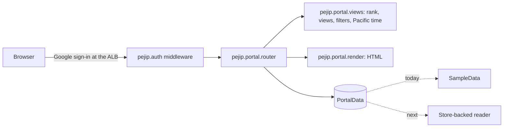

# 0013: Web portal (Home, Opportunities, Opportunity detail)

_Status: implemented (sample data). Last updated: 2026-10-05._

## Purpose

Give Babu a signed-in web view of the ranked roles at `job-search.zephyr-mcg.com`
instead of only the Markdown digest: what needs attention now, every active
opportunity with saved views and filters, and one role's full, cited explanation
(spec section 12).

## Scope

In scope: the Home, Opportunities and Opportunity detail pages from the portal mocks
(`Main`, `Opportunities` and `Opportunity` boards on the shared mock canvas, style
guide in the project files), served by the existing FastAPI app behind Google
sign-in, reading from a data interface with synthetic sample data behind it.

Out of scope for now:

- Reading the real database. The persistent store is being added separately
  ([0011: Daily run and storage](0011-daily-run-and-storage.md) on its branch); a
  store-backed reader plugs into the same interface when it lands.
- Feedback buttons (Interested, Watch, Not interested, Already applied) and "Search
  now": they need storage and a run trigger. The pages leave them out rather than
  show buttons that do nothing.
- Companies, Watchlist, Connections, Search Health and Settings: listed in the
  navigation as "Soon".

## Design



- **Server-rendered HTML, no JavaScript.** Views and filters are links and a GET
  form, so every state has a URL and nothing runs in the browser. Expanding a
  reason's evidence uses `<details>`.
- **One place per mock part.** `render.py` has a function per building block (nav,
  run line, opportunity card, compact card, table, fit bars, concerns, evidence),
  and `static/portal.css` is the style guide's block plus the screen additions, so a
  change to a mock maps to one edit. No templating library is added.
- **Ranking:** priority band, then Fit (unknown last), then freshness. Low and
  unranked roles appear only in "All active".
- **Unknowns are shown** as "Unknown" or "Not published", never hidden (spec 12.41);
  each Fit number links to its explanation (12.40); concerns sit next to reasons.
- **Times** are shown in Pacific time. The Alpine image has no time zone database,
  so `views.to_pacific` applies the US daylight saving rules itself.

## Interfaces

| Route | Shows |
|---|---|
| `GET /` | Home: counts, roles needing attention, new matches, changed roles, search health |
| `GET /opportunities` | Views (`view=attention, new, high-fit, immediate, watched, network, remote, changed, all`) and filters (`priority`, `fit`, `confidence`, `company`, `work_model`); unknown values are ignored |
| `GET /opportunities/{opportunity_id}` | One role: summary, fit bars, concerns, cited reasons, why now, who you know, description, original link; 404 page when unknown |
| `GET /portal.css` | Styles |

All four require sign-in like every route except `/healthz`. `create_app(data=...)`
takes any `pejip.portal.data.PortalData`:

```python
class PortalData(Protocol):
    is_sample: bool                       # shows the sample-data banner
    def latest_run(self) -> SearchRun | None: ...
    def opportunities(self) -> list[Opportunity]: ...
```

`Opportunity` carries what the pages need from the `jobs`, `recommendations`
(`fit`, `confidence`, `priority`, `detail` components) and explanation records
(`pejip.explain` points and citations), so the store-backed reader is a mapping
from those tables.

## Data model

No storage. `pejip.portal.sample` holds invented roles ("Company A", "Person A")
with times relative to the clock; every page says the data is illustrative while it
is in use.

## Non-functional considerations

- **Security:** pages carry their own content security policy (`PAGE_CSP` in
  `pejip.api`): no script at all, styles only from the app and Google Fonts, forms
  only back to the app, no framing. Every value is HTML-escaped (a test feeds
  `<script>` through every field), and links to original postings are shown only for
  `http(s)` URLs, with `rel="noopener noreferrer"`. The smoke test and DAST cover the
  pages through the OpenAPI document; the detail route's example id lets both reach
  a real role.
- **Privacy:** the browser loads the IBM Plex fonts from Google Fonts; no PEJIP data
  is sent (see [SECURITY.md](../SECURITY.md)).
- **Accessibility:** real links, buttons, labelled form controls, `aria-current` on
  the active page and view, 44px touch targets, and layouts that stack at phone
  width with tables in a scroll box.
- **Performance:** one small HTML response and one stylesheet per page; no
  client-side work.
- **Tests:** `tests/unit/test_portal.py` (pages, views, filters, escaping, time
  display), `tests/unit/test_api.py` (page policy, injected data) and
  `tests/system/test_api_smoke.py` (every page against the running server).

## Alternatives considered

- **Jinja2 templates:** familiar, but a new direct dependency; plain functions with
  `html.escape` cover three pages.
- **A Next.js front end** (spec 14): heavier to build, host and test for one user
  today; can come later behind the same routes' data.
- **Inline styles from the mocks:** would need `'unsafe-inline'` in the CSP; moved
  into classes instead.

## Open questions

- Babu has not reviewed the mocks yet; layout and wording are expected to change.
