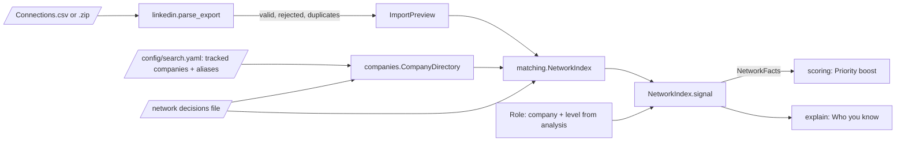

# 0014: Connection matching

_Status: implemented. Last updated: 2026-10-05._

## Purpose

The north star is three referral-backed interviews a month
([success scorecard](../success-scorecard.md)), so PEJIP has to answer "do I know
someone senior enough at this company to refer me?" for every ranked role. This
feature reads the candidate's LinkedIn Connections export, finds their **matured
connections** for each role, raises Application Priority for roles that have one,
and explains who they are. When a title has no clear level, the candidate decides
instead of PEJIP guessing.

A matured connection is a first-degree connection who, as of the last import, works
at the hiring company in a position comparable to the role's level or more senior
(Babu's definition, 2026-10-05).

## Scope

In scope: parsing and validating the export (spec 8.16 to 8.19), resolving employer
names to tracked companies (8.21, 13.3, 13.4), reading a seniority level from a
title, matured-connection matching (8.22), the Priority boost (8.25, 9.22), the
"Who you know" explanation, digest notes, and `pejip connections` to check an
export. All logic is pure and storage-agnostic.

Out of scope here: storing imports, connections and decisions in the database
(the "Database and daily search run" work owns the store; see Data model), the
portal import screens (the Connections mock), relationship strength entry,
connection relevance beyond level (8.24), and any outreach (Phase 2).

## Design

1. **Parse** (`pejip.network.linkedin`). Finds the header row after LinkedIn's
   notes preamble, reads `.csv` or the `Connections.csv` inside a `.zip`, and keeps
   first and last name, profile URL, company, position and connection date. Email
   addresses are dropped as they are read. Rows with no name, the wrong column
   count or unreadable characters are rejected with their line number; duplicates
   (same profile URL, or same name and company when there is no URL) are merged.
   Uploads over 20 MB, including zips that expand past it, are refused.
   `compare_imports` gives the New, Updated and gone counts against the previous
   import.
2. **Resolve companies** (`pejip.network.companies`). Order: the candidate's
   decisions, then exact matches after normalizing (case, punctuation, `&`, legal
   suffixes such as Inc. and LLC, spaces), then configured aliases, then fuzzy
   matching. A fuzzy match is taken only when one company is at least 95% similar;
   a 75% match, or a longer form of a tracked name ("Company X Cloud"), is
   **ambiguous** and held back until the candidate decides. Nobody is linked to a
   company by a guess (spec 8.21).
3. **Read a level** (`pejip.network.seniority`). Titles map to the scorer's ladder
   (C-level, SVP, VP and Head of, Senior Director, Director, below Director).
   Titles with no clear level are `UNCLEAR`: Partner, Principal, Fellow,
   Distinguished, Managing Director, General Manager, Founder, Chief of Staff,
   assistant and associate VPs and directors, board and advisor roles, past titles
   ("Former VP") and anything unrecognised. "Senior VP" and "Executive VP" are SVP.
   Words after "office of the" or "to the" name someone else's office, so
   "Director, Office of the CEO" is a Director.
4. **Match** (`pejip.network.matching`). For a role, every connection at the
   resolved company is `MATURED` (level at or above the role's), `NOT_MATURED`, or
   `YOUR_CALL` (unclear title with no decision yet). If the analysis left the
   role's level unknown, the role title is read the same way; if that is unclear
   too, every connection there is the candidate's call.
5. **Priority** (`pejip.scoring`). A matured connection adds 10 Priority points,
   otherwise any first-degree connection adds 3 (`network_priority_boost` in
   `config/search.yaml`, each 0 to 25). Fit never changes and the score is capped
   at 100. A role with Fit below `network_min_fit` (60) gains nothing, and the
   `priority_min_fit` floors still apply, so a weak-fit role stays weak however well
   connected (spec 8.26). `YOUR_CALL` connections
   add no boost until decided and add the reason `NETWORK_DECISION_NEEDED`.
6. **Explain** (`pejip.explain`). "Who you know" lists matured connections, then
   each "Your call" question, then how many others are below the role's level, and
   always the import date, because the data is a snapshot (spec 8.20). Past the
   first four of each, a line counts the rest so nobody is silently dropped. Each named
   person cites `{"type": "network", "connection_id": ...}`, which
   `verify_citations` checks against the role's own matches.

Decisions are keyed by company, title (normalized) and role level, never by person:
one answer covers everyone with that title there, and a re-import that changes the
title asks again. The company in a decision is resolved like any employer name, so
"scale ai" or an alias still matches.

## Interfaces

- `pejip connections <file>`: parses an export and prints counts, rejected rows by
  reason and line, connections per tracked company with unclear-title counts, and
  employer names to review. It prints no person's name.
- `pejip run` reads the export at `PEJIP_CONNECTIONS` and decisions at
  `PEJIP_NETWORK_DECISIONS` when they are set; the export file's modified time is
  the import date. On AWS, where there are no local files, `PEJIP_NETWORK_BUCKET`
  names the bucket instead: the run reads `network/<account>/Connections.csv` and, if present,
  `network/<account>/network-decisions.yaml` from the job-alert inbox bucket (KMS-encrypted,
  TLS-only, objects expire 90 days after upload), using the upload time as the
  import date. Babu uploads them from CloudShell (infra/README.md); the run's role
  can only list and read that prefix. Without an export the digest says network
  data has not been imported.
  A missing or unreadable export or decisions file never stops the run: the run
  goes ahead without connections and the digest says which file is at fault. Only
  the error type is logged, because the message can quote the file.
- Decisions file (YAML, outside the repository; see
  [examples/network-decisions.example.yaml](../../examples/network-decisions.example.yaml)):
  `companies` maps an employer name to a tracked company or `null` (a separate
  company), and `titles` lists `{company, position, role_level, matured}`.
- Python: `parse_export(data, imported_at) -> ImportPreview`,
  `compare_imports(previous, current)`, `CompanyDirectory.build(companies, aliases,
  decisions).resolve(raw)`, `title_level(title)`,
  `NetworkIndex.build(connections, directory, decisions).signal(company, role_level,
  role_title) -> NetworkSignal`, and `NetworkSignal.facts() -> NetworkFacts` for
  `JobFacts.network`.
- Digest: "Who you know" per role, plus notes "LinkedIn connections last refreshed:
  <date>" and the employer names waiting for review.
- Config: `scoring.network_priority_boost` and `network.company_aliases`. The scoring
  version is `fit-2`.

## Data model

Imports and decisions are not stored yet; each run reads the files. One thing is
stored: each recommendation's explanation, in the `recommendations` table, includes
the "Who you know" lines, so the names and titles of matured and "Your call"
connections for that role are kept with it. They follow that table's 90-day
retention and are included in `pejip export` and removed by `pejip delete-all`. The
entities follow spec 8.18 and 8.19 so the store can persist them as they are:

| Entity | Fields |
|---|---|
| `Connection` | `connection_id` (hash of profile URL, else name and company), `first_name`, `last_name`, `profile_url`, `company_raw`, `position_raw`, `connected_on`, `imported_at`, `relationship_strength` (`UNKNOWN` until the candidate sets it) |
| `ImportPreview` (import batch) | `source_type`, `source_file_hash`, `imported_at`, `records_parsed`, `records_accepted`, rejected rows, `duplicates`, `undated` |
| Company decision | employer name as imported → tracked company or none |
| `TitleDecision` | `company`, `position`, `role_level`, `matured` |

When the database lands, these become tables with the same 90-day retention as other
personal data (connections deleted 90 days after import, the upload deleted once an
import finishes), and the decisions file becomes rows the portal writes.

## Non-functional considerations

- **Privacy:** connection data is personal data (policy section 10). It stays on the
  machine running PEJIP: no connection data is sent to Claude or any other service,
  because matching is deterministic. Emails are never kept. Logs carry no names or
  profile URLs (`test_connections_raise_priority_explain_who_you_know_and_stay_out_of_logs`),
  and `pejip connections` prints none. Tests and examples use invented people only.
- **Security:** upload size and zip expansion are bounded; CSV is parsed with the
  standard library, and nothing from the file is executed or used in a path.
- **Correctness:** no guessing at either fork that matters: ambiguous employers are
  held back and unclear titles wait for a decision, both tested. The golden
  evaluation set feeds each case's connection counts (strong relationships standing
  in for matured connections) into scoring, so the boost and Fit invariance are
  checked on every change.
- **Performance:** linear in connections; fuzzy matching compares each distinct
  employer name with the tracked companies only.
- **AI cost:** none; no AI calls.

## Alternatives considered

- **AI title classification.** More coverage of odd titles, but it costs money,
  sends connection data to a third party, and still guesses. Rules plus "Your call"
  keep the candidate in charge.
- **Treating unclear titles as matured, or as not matured.** Either silently
  over- or under-states warm paths; Babu asked for unclear but important items to
  come to him.
- **Decisions per person.** The mock asks per person, but the same title at the
  same company is the same question; keying by title avoids asking twice and makes
  a changed title ask again.
- **Network as a Priority weight instead of a boost.** A weight would lower roles
  with no connections; a boost only raises, as spec 8.26 expects ("still an
  excellent career match").

## Open questions

- The ladder treats Head of as VP-level, as the scorer does; Babu may want Head of
  roles judged case by case.
- Boost sizes (10 and 3) are starting values, to be tuned once referral outcomes
  are recorded.
