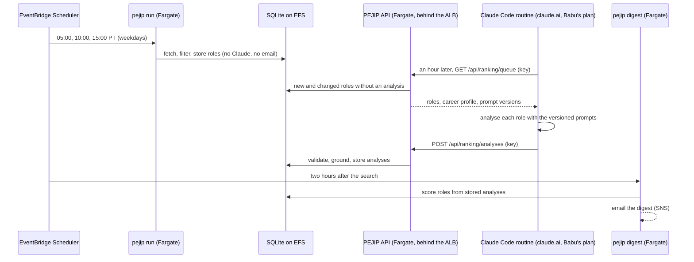

# 0015: Ranking through a Claude Code routine

_Status: implemented. Last updated: 2026-10-05._

## Purpose

Rank the daily roles without paid Claude API calls. Babu chose (2026-10-05) to
use their Claude plan instead of API credits. The plan can't be used from the
API or from an unattended server, but it does cover **Claude Code routines**:
scheduled Claude Code sessions on claude.ai that draw on the plan's usage. This
design moves the one model step of ranking, job analysis and evidence matching,
into a daily routine. Everything else stays on AWS. Decision record:
[ADR-0008](../adr/0008-ranking-through-a-claude-code-routine.md).

## Scope

In scope: holding the digest until the routine has run; two machine endpoints
for the routine; the routine itself; a separate digest task; the access key and
how it is rotated; evaluating the routine's output against the golden set.

Out of scope: changing the prompts, schemas, scoring or explanations. The
routine produces the same `JobAnalysis` and `EvidenceMatching` JSON the API path
produces, and PEJIP validates it with the same code. The API path stays in the
code base for later, behind `PEJIP_AI_ENABLED`.

## Design

1. **Weekdays 05:00, 10:00 and 15:00 Pacific, `pejip run`** (Babu chose digests at
   7 AM, 12 PM and 5 PM on weekdays, 2026-10-06). Unchanged, except that with `PEJIP_RANKER=routine` it
   never calls Claude and does not email. Roles already analysed and unchanged
   are still scored (the existing path); new and changed roles wait.
2. **06:04, 11:04 and 16:04, the routine.** A Claude Code routine on Babu's account runs in a
   cloud environment holding the access key. It runs
   `python -m pejip.routine fetch`, which writes the queue to a scratch file
   outside the repository. For each role, Claude follows
   `src/pejip/prompts/job_analysis.v1.md` and then `evidence_matching.v1.md`,
   writing one JSON result per role. `python -m pejip.routine submit` validates
   every result against the same Pydantic models before posting them, so a
   malformed result is fixed in the session rather than rejected later. The
   routine never commits or pushes, and its instructions say so.
3. **On submit, the API.** Each result is checked as the API path checks it:
   schema, `ground_analysis` and `ground_matching` (quotes must appear in the
   posting, evidence IDs must exist in the profile). A result for a stale
   `content_hash` is refused. Accepted results are stored as `analyses` rows
   whose provenance records `ranker: routine`, the prompt versions and the
   model the session reports.
4. **07:00, 12:00 and 17:00, `pejip digest`.** A second scheduled task re-ranks the latest run's
   roles with no AI client. Every role with a valid stored analysis is scored,
   explained and citation-checked by the existing code, and the digest is
   emailed. If the routine did not report, the digest goes out anyway, with
   the waiting roles unranked and a note saying the ranking routine did not run.

The queue holds at most `ai.max_jobs_per_run` (40) roles, oldest first, so a
backlog drains over several days instead of exhausting the plan's usage.

## Interfaces

Both endpoints require `Authorization: Bearer <key>` and skip Google sign-in at
the load balancer (a listener rule like `/healthz`'s). The app compares the
key's SHA-256 with the hash in SSM in constant time. A missing or wrong key
returns 401, and every response carries `Cache-Control: no-store`. The key and
the body size (at most 2 MB, with a declared length) are checked in middleware
before any body is read, since these bodies pass the WAF's 8 KB limit.

- `GET /api/ranking/queue` returns
  `{"profile": {...}, "prompts": {"JOB_ANALYSIS": "v1", "EVIDENCE_MATCHING": "v1"},
  "roles": [{"job_id", "content_hash", "title", "company", "location", "description"}]}`.
- `POST /api/ranking/analyses` takes
  `{"model": "...", "prompts": {...}, "results": [{"job_id", "content_hash",
  "analysis": {...}, "matching": {...}}]}` and returns
  `{"accepted": n, "rejected": [{"job_id", "reason"}]}`. The prompt versions
  must match the ones the queue served.

CLI, `python -m pejip.routine --work DIR`:

- `next` names the next step (a role's job analysis, then its evidence matching)
  and writes its instructions to `roles/<id>/step.md`: the same system prompt,
  input and JSON schema as the API call. The session writes the answer to the
  file it names and runs `next` again until it prints `DONE`. An answer that fails
  the API path's validation (schema, then grounding) comes back as `REDO` with the
  reason. `skip ROLE REASON` gives up on a role, which stays queued.
- `eval-prepare` and `eval-record` lay out the golden set and turn the answers into
  recordings; `PEJIP_EVAL_RECORDINGS` points the replay scorer at them.
- `fetch` and `submit` exchange roles and answers with the endpoints above,
  reading `PEJIP_RANKING_URL` and `PEJIP_RANKING_KEY` from the environment.

`pejip digest` scores the latest finished run's roles from stored analyses and
emails the digest, listing each role once and adding no recommendation row the
run already stored. A crash logs `digest_crashed`; a latest run more than 4
hours old logs `digest_run_stale` and says so in the digest (both ERROR). It logs `routine_results_missing` (ERROR, so the
`pejip-app-errors` alarm fires) when roles were waiting and the routine stored
nothing since the run began.

Infrastructure (`infra/`): `ranker` (default `routine`) sets `PEJIP_RANKER`;
a listener rule at priority 2 forwards `/api/ranking/*` without Google sign-in;
the task role may read `/pejip/ranking-key-sha256`; scheduled tasks are
`pejip-run-daily` (weekdays 05:00, 10:00 and 15:00 PT) and a new `pejip-digest-daily`
(`digest_schedule`, weekdays 07:00, 12:00 and 17:00 PT). The WAF common rule set's 8 KB body limit is
counted rather than blocked for `POST /api/ranking/analyses` only, by a
`body-size` rule that blocks it everywhere else.

## Data model

No schema change. Routine results are ordinary `analyses` rows with
`status = OK`; `provenance.ranker = "routine"` tells them apart. They follow the
90-day purge like every other row.

New SSM SecureString `/pejip/ranking-key-sha256` (encrypted with `alias/pejip`),
read by the API task role only. The key itself is never stored on AWS.

## Non-functional considerations

- **Security.** The key is the one long-lived secret in PEJIP, an exception to
  policy section 5 that needs Babu's approval. It reaches only the two
  endpoints. It is stored only as the cloud environment's secret on claude.ai,
  and on AWS only as its hash. It is rotated every 90 days, prompted by a
  scheduled reminder. The key is 48 random characters, so guessing it is not
  feasible; there is no WAF rate-limit rule, which would cost money for no real
  gain. Tests cover the 401s, the length checks and the stale-hash refusal.
- **Privacy.** The career profile and the day's postings enter the routine's
  session, so Claude Code's cloud joins the Anthropic API in `docs/SECURITY.md`.
  Session transcripts stay in Babu's claude.ai history until Babu deletes them,
  which is outside PEJIP's 90-day purge. This is a second retention exception
  for Babu to accept. Nothing personal is committed: the queue and results
  live in the session's scratch space.
- **AI quality (policy 12).** `eval-prepare` and `eval-record` run the committed
  golden set through the routine path: the same prompts, the session's model,
  and the same scorer. Like a live API run, it must hold the invariants
  (`--gate invariants`: every case scored, every citation valid, network
  invariance) before the routine is switched on and whenever a prompt changes;
  the other metrics are reported, since they vary from run to run. The first run
  (2026-10-05) held every invariant, with the other metrics within the spread of
  live API runs (see `eval/README.md`). The CI replay check is unchanged.
- **AI cost (policy 13).** No API spend. The routine draws on Babu's plan, so
  the cost guard does not see it. The policy wording is updated to say so.
- **Reliability.** A missed or failed routine only delays ranking: the roles stay
  queued for the next day, and the digest still arrives with them unranked. The
  digest task logs `routine_results_missing` when nothing arrived since the
  run, and monitoring alarms on it.
- **SQLite.** The API writes analyses at 07:00, when neither scheduled task is
  running. Writes are short transactions, and SQLite's locking works on EFS.

## Alternatives considered

- **API credits.** The supported path for unattended jobs, about $10 to $25 a
  month. Babu chose not to pay for API usage on top of their plan.
- **Claude Code headless on Fargate with a plan token (`claude setup-token`).**
  Anthropic's terms describe plan sign-in as for "ordinary use of Claude Code",
  so an unattended server job is a grey area. It also needs a one-year token on
  AWS and adds Claude Code to the image. Rejected.
- **Routine with AWS credentials** (reading EFS or S3 directly). That needs
  long-lived AWS access keys outside AWS, a broader credential than one scoped
  to two endpoints. Rejected.
- **Exchanging data through the repository.** Career data must never be
  committed, even to a private repository. Rejected.

## Open questions

- Which model the plan's routine uses. The eval records it, and the golden set
  decides whether it is good enough.
- Whether 40 roles a day fit the plan's usage alongside Babu's own Claude use.
  The first weeks' routine runs will show it.
