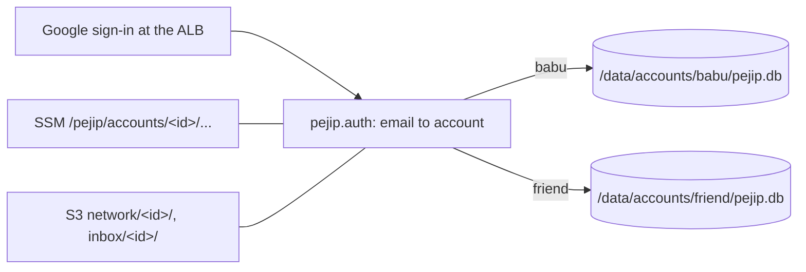

# 0016: Separate, private accounts

_Status: accepted (steps 1 to 4 of 6 implemented). Last updated: 2026-10-06._

## Purpose

Babu wants a friend to use PEJIP too, with each person's searches independent and
private. Every piece of personal data (roles found, rankings, decisions, profile,
target companies, connections, job-alert mail, digest) is keyed to the Google
account that signs in, and no account can ever read another's.

## Scope

In scope: an account registry, per-account storage, inbox, digest, daily run and
ranking key, deleting an account, and onboarding the friend.

Out of scope: self sign-up (Babu adds each account by hand), sharing between
accounts, and per-account infrastructure (one deployment serves everyone,
[ADR-0010](../adr/0010-one-deployment-separate-accounts.md)).

## Design

One deployment. Sign-in at the load balancer is unchanged
([0009](0009-google-sign-in.md)); the app maps the verified email to an account
and every read and write goes through that account's own storage.

Isolation comes from separate files and paths, not from filtering shared tables:
the other account's rows are never in the file a request opens, so a missing
`WHERE` cannot leak them.

| Area | Per account |
|---|---|
| Sign-in | `PEJIP_AUTH_ACCOUNTS` maps `id=email`; unknown emails get 403 |
| Database | `/data/accounts/<id>/pejip.db` on EFS |
| Profile, companies | SSM `/pejip/accounts/<id>/profile`, `/pejip/accounts/<id>/companies` |
| Connections | S3 `network/<id>/` (KMS, 90-day expiry) |
| Job-alert inbox | `<id>@inbox.job-search.zephyr-mcg.com`, stored under `inbox/<id>/` |
| Digest | SNS topic `pejip-digest-<id>`, subscribed to that account's email only |
| Ranking | one routine key per account, its hash at `/pejip/accounts/<id>/ranking-key-sha256`; the key alone picks the account. Each person's routine runs on their own Claude plan |
| Retention | the 90-day purge runs for every account |

Build order, each a small high-risk PR:

1. **Account registry and sign-in** (this step). The app returns an `Account`
   (`id`, `email`) for the verified email and keeps it on `request.state.account`.
   Until step 2 lands, the registry may hold only one account; the app and the
   Terraform variable both refuse a second.
2. **Per-account storage** (this step). Settings that name a personal place
   carry an `{account}` placeholder that `Settings.from_env` fills from
   `PEJIP_ACCOUNT` (default `babu`): the database
   (`/data/accounts/{account}/pejip.db`), digests
   (`/data/accounts/{account}/output`), profile and companies
   (`/pejip/accounts/{account}/...`) and LinkedIn files (`network/{account}/`).
   `pejip.accounts.open_store` makes the folder and, for Babu's account only,
   adopts the pre-account data: a consistent copy of `/data/pejip.db` (the
   original stays for a rollback; the copy is linked into place so it can never
   overwrite a database already there) and a move of the old digests, so the
   90-day purge still covers them. Babu copies the SSM parameters and moves the
   S3 files by hand before applying (`infra/README.md`). The AI spend ledger stays
   shared, as the $100 cap covers the whole deployment. The one-account guard
   stays until the portal's Settings page and the ranking routine are per account
   (steps 3 and 4).
3. **Per-account inbox, digest and scheduled runs** (this step). SES has one
   receipt rule per account: `alerts@` stays Babu's and lands in
   `inbound/babu/`; another account receives at `<id>@inbox.job-search.zephyr-mcg.com`
   into `inbound/<id>/`, and each run reads only its own folder
   (`PEJIP_INBOX_PREFIX`). Each account has its own SNS digest topic, subscribed
   to its own email (`PEJIP_DIGEST_TOPICS`); Babu's keeps the name `pejip-digest`
   and its confirmed subscription (Terraform `moved` blocks). `pejip run`,
   `digest` and `purge` loop over `PEJIP_ACCOUNTS`; one account's crash is logged
   with its id and the others still run, then the task fails. A place setting
   without `{account}` is Babu's alone: any other account refuses it and defaults
   to places under `accounts/<id>/`, and gets no digest rather than Babu's topic.
4. **Per-account ranking keys and portal settings** (this step). Each account's
   key hash is at `/pejip/accounts/<id>/ranking-key-sha256`
   (`PEJIP_RANKING_KEY_PARAMETER` with `{account}`); Babu's account also reads
   the original `/pejip/ranking-key-sha256` until he moves it. The ranking API
   holds one service per account (`RankingServices`) and compares the request's
   key with every account's hash in constant time: the matching account's
   database and profile are the only ones the request can read or write. The
   portal's Settings page shows the signed-in account's own companies and
   job-alert address.
5. Delete-an-account, and `docs/SECURITY.md` updates.
6. Onboard the friend: Google test user, registry entry, inbox address, ranking key.

## Interfaces

- **`PEJIP_AUTH_ACCOUNTS`:** comma-separated `id=email` pairs. Ids are lowercase
  letters, digits and dashes, starting with a letter (they name folders and
  parameter paths); ids and emails are unique; emails compare without case.
  Malformed entries stop the app at start, and the error never repeats an email.
- **Per-account settings:** `PEJIP_ACCOUNT` (default `babu`) picks the account a
  command works on; `PEJIP_DATABASE_URL`, `PEJIP_OUTPUT_DIR`,
  `PEJIP_PROFILE_PARAMETER`, `PEJIP_COMPANIES_PARAMETER` and
  `PEJIP_NETWORK_PREFIX` may hold `{account}`. `PEJIP_LEGACY_DATABASE_URL` and
  `PEJIP_LEGACY_OUTPUT_DIR` name the pre-account places, read only for `babu`.
- **Ranking keys:** `PEJIP_RANKING_KEY_PARAMETER` (may hold `{account}`),
  `PEJIP_LEGACY_RANKING_KEY_PARAMETER` and `PEJIP_RANKING_KEY_SHA256` (both
  Babu's alone).
- **`PEJIP_AUTH_ALLOWED_EMAIL`:** still read when `PEJIP_AUTH_ACCOUNTS` is absent,
  as account `babu`, so a rollback to an older task definition keeps working.
- **Terraform:** variable `sign_in_accounts` (`map(string)`, sensitive, empty by
  default meaning `{ babu = sign_in_email }`), validated to at most one entry until
  step 2.
- **Google:** the consent screen stays in Testing; each account's Gmail is added as
  a test user (Testing allows up to 100).

## Data model

Step 1 changes no stored data. From step 2 the account id is part of every storage
path: the database schema is unchanged, there is just one database per account.
Rollback: an older task definition still points at `/data/pejip.db`, which the
adoption copied and left in place (it misses only what was written after the
move).

## Non-functional considerations

- **Security:** fail closed as before; an email outside the registry gets 403. Unit
  tests cover registry parsing, the rollback fallback, two accounts resolving to
  their own ids, and the one-account guard.
- **Privacy:** logs carry the account id, never the email. Babu, as AWS
  administrator, could technically read another account's data although the app
  never shows it; the friend is told this before uploading anything (step 5 puts
  it in `docs/SECURITY.md`). The friend's full digest goes to their own email, the
  same accepted exception as Babu's.
- **Cost:** about $1 to $2 a month more in total (parameters, a second small
  database, a second run); ranking on the friend's own plan costs Babu nothing.

## Alternatives considered

See [ADR-0010](../adr/0010-one-deployment-separate-accounts.md): a deployment per
person (about $35 to $40 a month more, past the $50 budget), the friend running
their own copy, and one shared database with an `account_id` column.

## Open questions

None. Babu's decisions (2026-10-06): one shared site, the friend ranks on their own
Claude plan, the friend is told about admin visibility, and gets the full digest.
