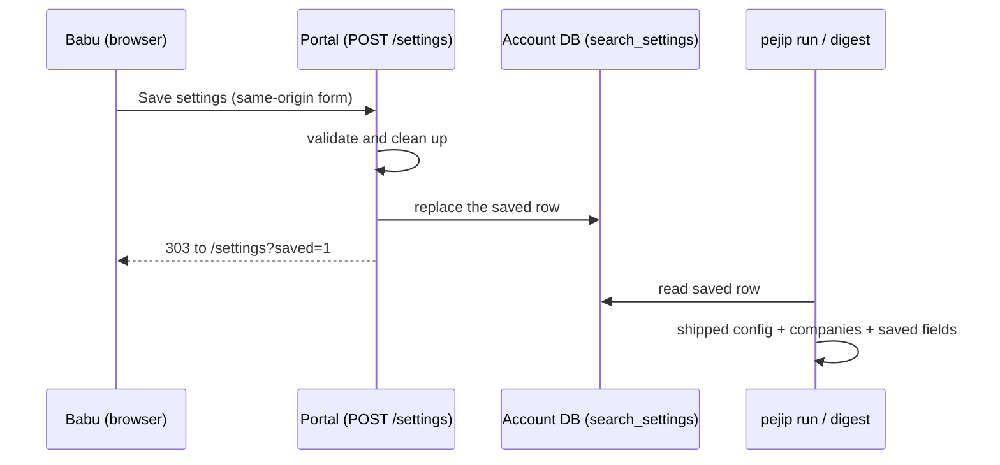

# 0017: Editable search settings

_Status: implemented. Last updated: 2026-10-06._

## Purpose

Babu asked (2026-10-06) for the portal's Settings page to be editable, so that what
he saves there is what the three weekday runs (search, ranking routine, digest)
use next, without a code change or a pull request.

## Scope

In scope, per account: the title words discovery uses (role words, words that make
a title senior, words that never count as senior; see ADR-0011, where a title is
one signal of level rather than a gate) and where roles may be (each location's
places and preference, and whether roles outside every location are hidden). These are the fields the
discovery filter and the digest's location priority read.

Out of scope, still read-only on the page:

- **Companies and alert sources:** the private company list stays in its
  encrypted SSM parameter ([ADR-0009](../adr/0009-private-inputs-outside-the-public-repository.md)).
  Writing it from the app would give the web role `ssm:PutParameter`.
- **Ranking weights, bands and AI limits:** ranking changes must pass the
  committed evaluation set before they ship (policy section 12), and the AI
  limits sit under the cost cap (policy section 13). Both change through a
  reviewed pull request.
- **Schedule, retention and privacy:** fixed by infrastructure and policy.
- **The career profile:** not shown on Settings.

## Design

`pejip.companies.load_search_config` builds every run's configuration: the
shipped `config/search.yaml`, then the account's private companies, then the
saved settings (`apply_saved`), which replace the `taxonomy` and `geography`
sections whole. `pejip run` and `pejip digest` pass the account's store, so the
next scheduled search and digest use the latest save. The ranking routine
analyses the roles that search found, so it follows the same settings; its own
endpoints read only `ai.max_jobs_per_run`, which is not editable.

Because a save replaces whole sections, a later change to those sections of the
shipped file does not reach an account with saved settings until it goes back to
the defaults. The page says so beside the save time.

If a saved row can no longer be read (a future schema change), the run uses the
shipped settings, logs `saved_settings_unreadable` (no values) and the digest
says so.

## Interfaces

- `GET /settings`: the Roles and Locations cards are one form when the server has
  an account database (`PEJIP_DATABASE_URL` set); read-only otherwise (sample
  data). `?saved=1` shows the confirmation after a save.
- `POST /settings` (form-encoded): `seniority_patterns`, `role_terms`,
  `excluded_title_patterns` (one per line or comma), `places.<SCOPE>`,
  `preference.<SCOPE>` (Preferred, Acceptable or Undesirable) for each location
  the page shows, and `hard_filter=on`; or `action=reset` to go back to the
  defaults. Answers 303 to `/settings?saved=1`, 403 without a same-site `Origin`,
  404 where saving is not possible, 413 above 64 KB, and 422 with the page and the
  reason when a value is refused.
- `portal.data.SearchSettings` (`saved_at(account)`, `save(account, saved)`),
  implemented by `pejip.api.AccountSettings`.

## Data model

New table `search_settings` in each account's database: `id`, `settings` (JSON of
`SavedSettings`: `taxonomy` and `geography`), `saved_at`. One row at most; a save
replaces it and a reset deletes it. Created by `create_all`, so existing
databases gain it on first open with no migration step. Saving before the first
search creates the account's database.

The row holds search preferences, not career data. Like the private company
list, it is kept until changed rather than purged after 90 days, so a quiet
quarter never silently reverts it. `pejip export` and `pejip delete-all` include
it.

## Non-functional considerations

- **Security:** sign-in as for every page; the same-origin check used by the
  decision buttons (CSRF); a 64 KB body limit; at most 100 entries of 80
  characters per list, from a fixed character set, lower-cased. Only the
  locations the page offers are read, so a post cannot add new keys. Every value
  is escaped when shown. Logs record that a save happened, never the values.
- **Reliability:** a bad save is refused with the typed values shown again; an
  unreadable saved row falls back to the shipped settings and is noted in the
  digest.
- **Accessibility:** labelled fields with hints, fieldsets per location, a status
  message after a save and an alert when refused; no script.
- **Tests:** `tests/unit/test_search_settings.py` (cleaning, limits, storage,
  fallback), `tests/unit/test_portal_settings.py` (form, CSRF, size, errors),
  `tests/unit/test_api.py` and `tests/unit/test_cli.py` (saved values reach the
  page, the search and the digest), and the system smoke test saves and resets
  on the running server.

## Alternatives considered

- **Write to SSM, next to the profile and company list:** needs
  `ssm:PutParameter` and KMS encrypt for the web role and a Terraform apply, for
  data that is not secret. The account database is already per account and
  already read by every run.
- **Store only the differences from the shipped file:** later shipped changes
  would still apply, but removals and reordering are hard to express and to show.
  Whole sections plus a "go back to the defaults" button is simpler to reason
  about.
- **Edit ranking weights too:** rejected for now; see Scope.

## Open questions

- Should company watch and the career profile become editable here later?
