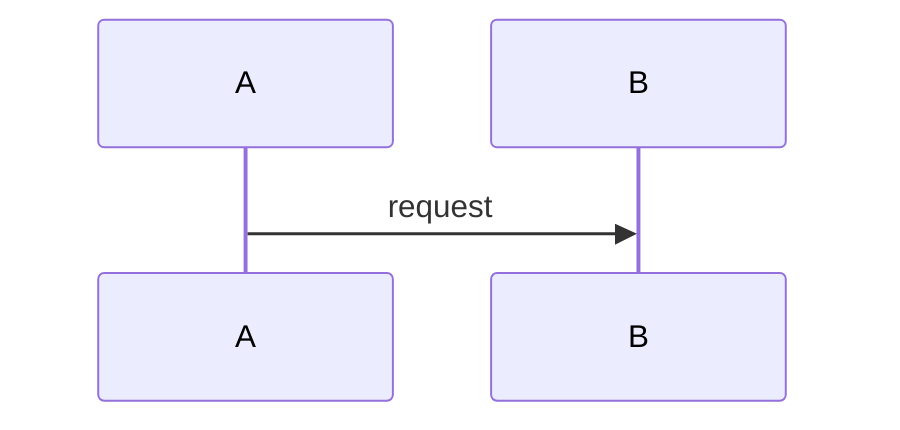

# NNNN: Feature title

_Status: draft | accepted | implemented | superseded. Last updated: YYYY-MM-DD._

## Purpose

What problem this feature solves and for whom.

## Scope

In scope, and explicitly out of scope.

## Design

How it works. Include a Mermaid diagram where it helps.

## Interfaces

APIs, events, files or UI it exposes or consumes, with their contracts.

## Data model

Entities, fields and storage; schema changes and migrations.

## Non-functional considerations

Performance, security, reliability, accessibility, and how each is tested.

## Alternatives considered

Options rejected and why. Link any ADRs.

## Open questions
